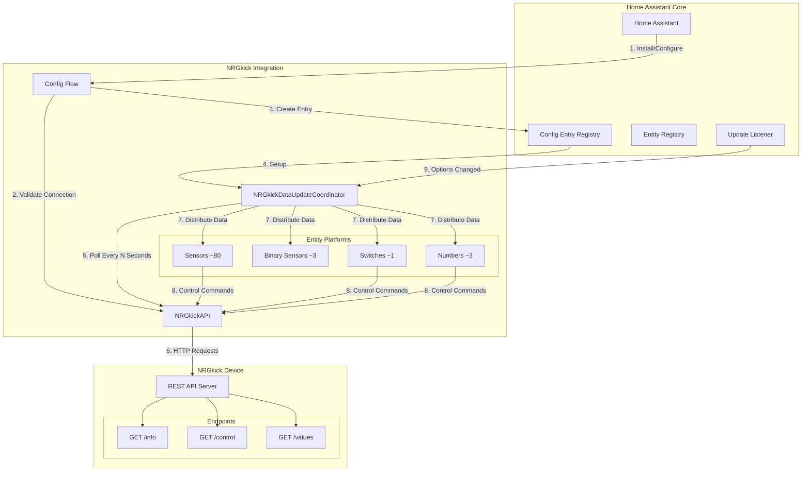
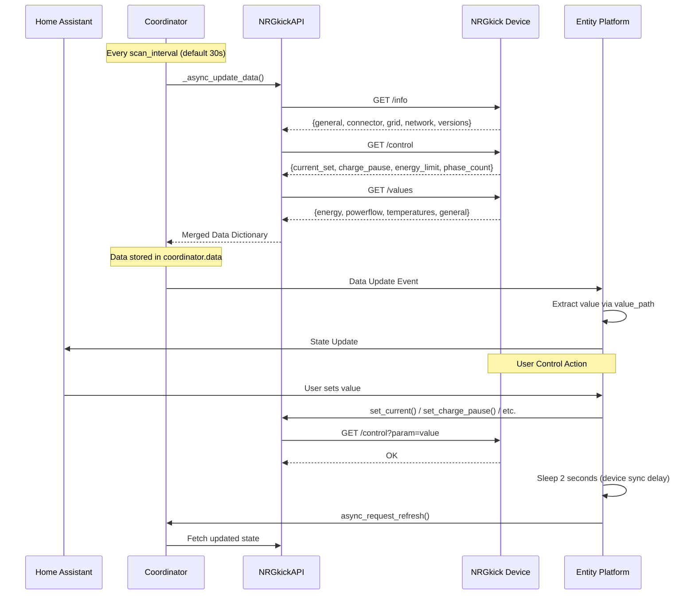
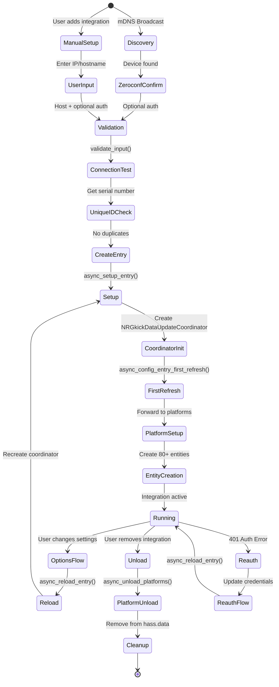
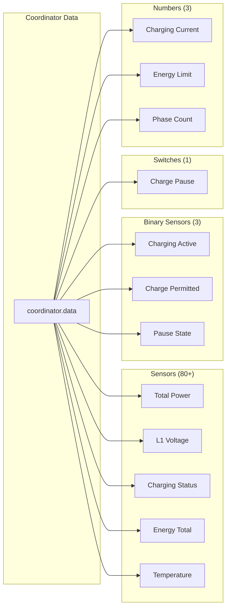
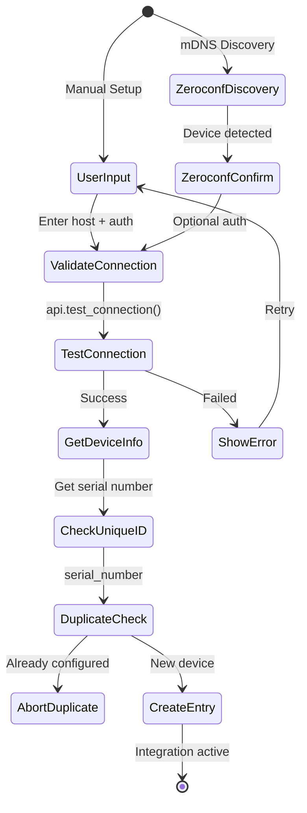
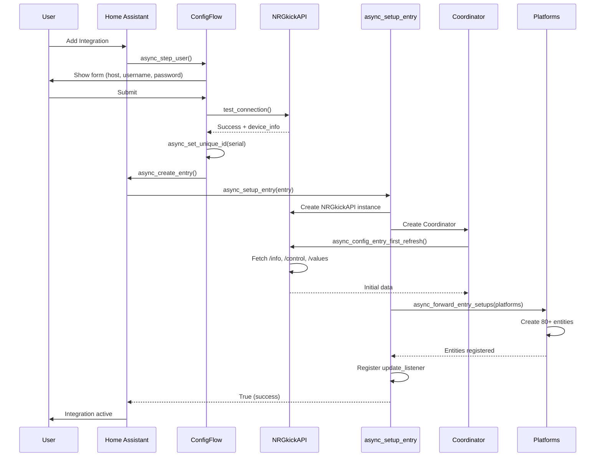
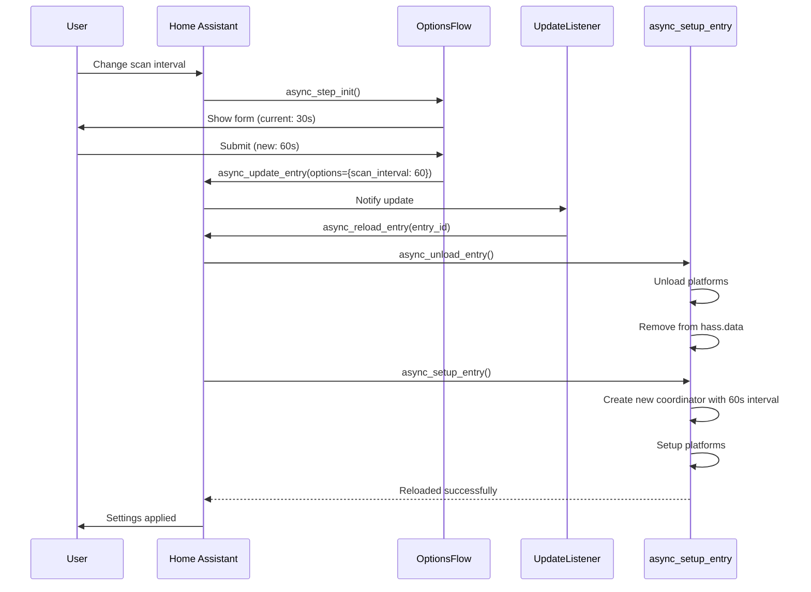

# NRGkick Home Assistant Integration - Architecture Documentation

## Table of Contents

1. [Overview](#overview)
2. [System Architecture](#system-architecture)
3. [Integration Registration & Lifecycle](#integration-registration--lifecycle)
4. [Data Flow & Polling](#data-flow--polling)
5. [Entity Registration & Mapping](#entity-registration--mapping)
6. [Configuration System](#configuration-system)
7. [Home Assistant Event Handling](#home-assistant-event-handling)
8. [UI Integration](#ui-integration)
9. [Code Structure](#code-structure)
10. [Key Design Patterns](#key-design-patterns)

---

## Overview

The NRGkick integration is a local polling-based Home Assistant custom component that communicates with NRGkick Gen2 EV charging devices through their HTTP REST JSON API. The architecture follows Home Assistant 2025.10+ standards:

- **Config Flow**: Provides UI-based configuration with validation, unique device identification, and comprehensive options management including connection reconfiguration.
- **DataUpdateCoordinator**: Implements the coordinator pattern to centralize API polling, preventing multiple entities from making redundant HTTP requests.
- **Custom Exception Hierarchy**: Uses typed exceptions (`NRGkickApiClientCommunicationError`, `NRGkickApiClientAuthenticationError`) for proper error handling and re-authentication flows.
- **Platform Entities**: Implements Home Assistant entity platforms (sensor, binary_sensor, switch, number) to expose device data and controls.
- **Async/Await**: Uses Python's async/await throughout to prevent blocking the Home Assistant event loop during network I/O.
- **Zeroconf Discovery**: Implements Home Assistant's discovery mechanism to detect devices via mDNS broadcasts using modern import paths.

---

## System Architecture

### High-Level Component Diagram



### Data Flow Architecture



---

## Integration Registration & Lifecycle

### 1. Entry Point: `manifest.json`

Home Assistant discovers integrations through the `manifest.json` file:

```json
{
  "domain": "nrgkick",
  "name": "NRGkick",
  "config_flow": true,
  "zeroconf": ["_nrgkick._tcp.local."],
  "requirements": ["aiohttp>=3.8.0"],
  "iot_class": "local_polling"
}
```

**Key Properties:**

- `domain`: Unique identifier for the integration (`"nrgkick"`)
- `config_flow`: Enables UI-based configuration (no manual YAML editing)
- `zeroconf`: Enables automatic discovery via mDNS service `_nrgkick._tcp.local.`
- `requirements`: Python package dependencies (only `aiohttp`)
- `iot_class`: `local_polling` indicates local network polling (no cloud)

### 2. Integration Lifecycle Flow



### 3. Setup Entry (`__init__.py::async_setup_entry`)

This function is Home Assistant's entry point for setting up the integration after a config entry has been created (either through user configuration or discovery).

```python
async def async_setup_entry(hass: HomeAssistant, entry: ConfigEntry) -> bool:
    """Set up NRGkick from a config entry."""
    # 1. Initialize the domain storage
    hass.data.setdefault(DOMAIN, {})

    # 2. Create API client with stored credentials
    api = NRGkickAPI(
        host=entry.data["host"],
        username=entry.data.get("username"),
        password=entry.data.get("password"),
        session=async_get_clientsession(hass),  # Reuse HA's aiohttp session
    )

    # 3. Create coordinator with configurable scan interval
    coordinator = NRGkickDataUpdateCoordinator(hass, api, entry)

    # 4. Perform first data fetch (raises exception if device unavailable)
    await coordinator.async_config_entry_first_refresh()

    # 5. Store coordinator for entity platforms to access
    hass.data[DOMAIN][entry.entry_id] = coordinator

    # 6. Forward setup to entity platforms (sensor, switch, number, binary_sensor)
    await hass.config_entries.async_forward_entry_setups(entry, PLATFORMS)

    # 7. Register listener for options changes (scan interval updates)
    entry.async_on_unload(entry.add_update_listener(async_reload_entry))

    return True
```

**Integration with Home Assistant:**

1. **Storage in `hass.data`**: Home Assistant provides `hass.data` as a dictionary for integrations to store runtime data. We use `hass.data[DOMAIN][entry.entry_id]` to store the coordinator, making it accessible to all entity platforms. The `entry_id` key allows multiple NRGkick devices to coexist in the same Home Assistant instance.

2. **Session Reuse**: `async_get_clientsession(hass)` returns Home Assistant's global aiohttp ClientSession, which maintains a connection pool and reduces overhead compared to creating a new session per integration.

3. **First Refresh Validation**: `async_config_entry_first_refresh()` is a DataUpdateCoordinator method that performs the initial data fetch. If this fails, Home Assistant prevents entity creation and marks the integration as failed setup, avoiding the creation of unavailable entities.

4. **Platform Forwarding**: `async_forward_entry_setups()` delegates setup to each entity platform file (sensor.py, switch.py, etc.). Each platform's `async_setup_entry()` function receives the config entry and can retrieve the coordinator from `hass.data`.

5. **Update Listener**: The update listener is called when the user modifies options (like scan interval). `entry.async_on_unload()` ensures the listener is removed when the integration is unloaded, preventing memory leaks.

---

## Data Flow & Polling

### 1. Coordinator Pattern

The `NRGkickDataUpdateCoordinator` inherits from Home Assistant's `DataUpdateCoordinator` base class, which handles the polling loop, error recovery, and entity notifications:

```python
class NRGkickDataUpdateCoordinator(DataUpdateCoordinator):
    """Class to manage fetching NRGkick data from the API."""

    def __init__(self, hass: HomeAssistant, api: NRGkickAPI, entry: ConfigEntry) -> None:
        # Get scan interval from options (user-configured) or fallback to default
        scan_interval = entry.options.get(
            CONF_SCAN_INTERVAL,
            entry.data.get(CONF_SCAN_INTERVAL, DEFAULT_SCAN_INTERVAL),
        )

        super().__init__(
            hass,
            _LOGGER,
            name=DOMAIN,
            update_interval=timedelta(seconds=scan_interval),  # Configurable polling
        )

    async def _async_update_data(self) -> dict[str, Any]:
        """Update data via library."""
        try:
            # Fetch all three endpoints sequentially
            # Note: These could be parallelized with asyncio.gather() for better performance
            info = await self.api.get_info()
            control = await self.api.get_control()
            values = await self.api.get_values()

            # Return merged data structure
            # This becomes available as coordinator.data to all entities
            return {
                "info": info,
                "control": control,
                "values": values,
            }
        except NRGkickApiClientAuthenticationError as err:
            # ConfigEntryAuthFailed triggers HA's reauth flow
            # User sees notification to reconfigure credentials
            raise ConfigEntryAuthFailed from err
        except NRGkickApiClientCommunicationError as err:
            # UpdateFailed logs the error and schedules retry
            # Entities become unavailable until next successful update
            raise UpdateFailed(f"Error communicating with API: {err}") from err
```

**How the Coordinator Integrates:**

- **Polling Loop**: The base class manages a background task that calls `_async_update_data()` every `update_interval` seconds. We don't need to implement timer logic.

- **Entity Notifications**: When data is successfully fetched, the coordinator automatically notifies all registered `CoordinatorEntity` instances by calling their update methods. This is handled by the base class.

- **Error Handling**: The coordinator catches two types of custom exceptions:

  - `NRGkickApiClientAuthenticationError` → Raises `ConfigEntryAuthFailed` to trigger Home Assistant's re-authentication flow
  - `NRGkickApiClientCommunicationError` → Raises `UpdateFailed` to log the error and retry later

  When errors occur, entities become unavailable until the next successful update.

- **Data Availability**: The returned dictionary is stored in `coordinator.data` and remains available to entities between updates. This allows entities to access the last known good data even if a poll fails.

**Data Structure:**

```python
{
    "info": {
        "general": {"serial_number", "device_name", "model_type", "rated_current"},
        "connector": {"phase_count", "max_current", "type", "serial"},
        "grid": {"voltage", "frequency", "phases"},
        "network": {"ip_address", "mac_address", "ssid", "rssi"},
        "versions": {"sw_sm", "hw_sm"}
    },
    "control": {
        "current_set": 16.0,
        "charge_pause": 0,
        "energy_limit": 0,
        "phase_count": 3
    },
    "values": {
        "general": {"status", "charging_rate", "vehicle_connect_time", ...},
        "energy": {"total_charged_energy", "charged_energy"},
        "powerflow": {"total_active_power", "l1": {...}, "l2": {...}, "l3": {...}},
        "temperatures": {"housing", "connector_l1", "connector_l2", "connector_l3"}
    }
}
```

### 2. API Client (`api.py::NRGkickAPI`)

The API client encapsulates all HTTP communication with the device. It uses a custom exception hierarchy for proper error handling:

```python
class NRGkickApiClientError(Exception):
    """Base exception for NRGkick API client errors."""

class NRGkickApiClientCommunicationError(NRGkickApiClientError):
    """Exception to indicate communication errors."""

class NRGkickApiClientAuthenticationError(NRGkickApiClientError):
    """Exception to indicate authentication errors."""

class NRGkickAPI:
    def __init__(self, host: str, username: str | None, password: str | None,
                 session: aiohttp.ClientSession | None):
        self.host = host
        self.username = username
        self.password = password
        self._session = session
        self._base_url = f"http://{host}"

    async def _request(self, endpoint: str, params: dict | None = None) -> dict:
        """Make a request with optional BasicAuth."""
        url = f"{self._base_url}{endpoint}"
        auth = aiohttp.BasicAuth(self.username, self.password) if self.username else None

        try:
            async with asyncio.timeout(10):  # 10-second timeout
                async with self._session.get(url, auth=auth, params=params) as response:
                    if response.status in (401, 403):
                        raise NRGkickApiClientAuthenticationError(
                            "Authentication failed"
                        )
                    response.raise_for_status()
                    return await response.json()
        except (asyncio.TimeoutError, aiohttp.ClientError) as err:
            raise NRGkickApiClientCommunicationError(
                f"Error communicating with API: {err}"
            ) from err
```

**Design Considerations:**

- **Custom Exception Hierarchy**: Three exception types provide clear error semantics:

  - `NRGkickApiClientError` (base) - Catch-all for API errors
  - `NRGkickApiClientCommunicationError` - Network issues, timeouts, connection failures
  - `NRGkickApiClientAuthenticationError` - Invalid credentials (401/403 responses)

  This typed approach allows the coordinator to handle authentication errors differently (trigger re-auth) versus communication errors (retry).

- **Session Management**: The session is passed in from Home Assistant rather than created internally. This allows the integration to leverage Home Assistant's connection pooling and SSL context.

- **Timeout Handling**: The 10-second timeout prevents hung connections from blocking the coordinator indefinitely. If the timeout expires, `asyncio.timeout` raises `TimeoutError`, which is caught and converted to `NRGkickApiClientCommunicationError`.

- **Authentication Error Detection**: The API explicitly checks for 401/403 status codes before calling `raise_for_status()`, converting them to `NRGkickApiClientAuthenticationError` for proper re-authentication flow handling.

- **Query Parameters**: Both read operations (filtering sections) and write operations (control commands) use GET requests with query parameters. While this isn't RESTful best practice, it matches the device's API design.

**Read Operations:**

- `get_info(sections)` → `GET /info?general=1&network=1&...`
- `get_control()` → `GET /control`
- `get_values(sections)` → `GET /values?energy=1&powerflow=1&...`

**Write Operations (Control Commands):**

- `set_current(16.0)` → `GET /control?current=16.0`
- `set_charge_pause(True)` → `GET /control?pause=1`
- `set_energy_limit(5000)` → `GET /control?energy=5000`
- `set_phase_count(3)` → `GET /control?phases=3`

### 3. Polling Cycle Timing

```mermaid
gantt
    title Polling Timeline (scan_interval = 30s)
    dateFormat s
    axisFormat %Ss

    section Coordinator
    Poll Request     :a1, 0, 1s
    API Calls        :a2, after a1, 3s
    Data Processing  :a3, after a2, 1s
    Entity Updates   :a4, after a3, 1s
    Idle Time        :a5, after a4, 24s
    Poll Request     :a6, after a5, 1s

    section Entities
    Receive Update   :b1, 5, 1s
    State Update     :b2, after b1, 1s
    HA UI Refresh    :b3, after b2, 1s
```



**Polling Cycle Breakdown:**

- **0-1s**: Coordinator initiates poll request
- **1-4s**: Three HTTP requests to device (`/info`, `/control`, `/values`)
- **4-5s**: Process and merge JSON responses
- **5-6s**: Notify all entities of data update
- **6-7s**: Entities extract values and update state
- **7-30s**: Idle period until next scan interval
- **30s**: Next poll cycle begins

**Scan Interval Configuration:**

- Default: 30 seconds (`DEFAULT_SCAN_INTERVAL`)
- Range: 10-300 seconds (`MIN_SCAN_INTERVAL` to `MAX_SCAN_INTERVAL`)
- User-configurable via Options Flow
- Changes trigger automatic coordinator reload

---

## Entity Registration & Mapping

### 1. Platform Setup Pattern

Each entity platform file implements `async_setup_entry()`, which Home Assistant calls during the forwarding phase. The pattern is consistent across all platforms:

```python
async def async_setup_entry(
    hass: HomeAssistant,
    entry: ConfigEntry,
    async_add_entities: AddEntitiesCallback,
) -> None:
    """Set up NRGkick sensors based on a config entry."""
    # 1. Get coordinator from hass.data registry
    coordinator = hass.data[DOMAIN][entry.entry_id]

    # 2. Create entity instances with value_path configuration
    entities = [
        NRGkickSensor(
            coordinator,
            key="total_active_power",
            name="Total Active Power",
            unit=UnitOfPower.WATT,
            device_class=SensorDeviceClass.POWER,
            state_class=SensorStateClass.MEASUREMENT,
            value_path=["values", "powerflow", "total_active_power"],
            precision=2,
        ),
        # ... 80+ more sensors
    ]

    # 3. Register entities with Home Assistant
    async_add_entities(entities)
```

**Platform Integration:**

- **Coordinator Retrieval**: Each platform retrieves the coordinator from `hass.data[DOMAIN][entry.entry_id]`. This is the same coordinator instance created in `async_setup_entry()`.

- **Entity Creation**: Entities are instantiated with a reference to the coordinator. Each entity class inherits from `CoordinatorEntity`, which automatically subscribes to coordinator updates.

- **Entity Registration**: `async_add_entities()` is a callback provided by Home Assistant. It adds entities to the entity registry and starts their lifecycle. Once registered, entities begin receiving updates when the coordinator fetches new data.

- **Declarative Configuration**: Entity definitions use a declarative approach with `value_path` arrays. This separates data mapping from entity logic, making it easier to add new entities without writing custom property methods.

### 2. Value Path Mapping System

Rather than hard-coding data access in each entity's properties, the integration uses a generic path-based system to navigate the nested data structure:

```python
value_path = ["values", "powerflow", "l1", "voltage"]
# Maps to: coordinator.data["values"]["powerflow"]["l1"]["voltage"]
```

**Entity Value Extraction:**

Each sensor implements `native_value` property, which Home Assistant calls to get the current state:

```python
@property
def native_value(self) -> float | int | str | None:
    """Return the state of the sensor."""
    data = self.coordinator.data
    for key in self._value_path:
        if data is None:
            return None
        data = data.get(key)  # Traverse the nested dictionary

    # Optional transformation function
    if self._value_fn and data is not None:
        return self._value_fn(data)
    return data
```

**How This Works:**

1. **CoordinatorEntity Inheritance**: By inheriting from `CoordinatorEntity`, the sensor automatically gets a reference to `self.coordinator`, and Home Assistant calls `native_value` whenever the coordinator updates.

2. **Path Traversal**: The loop iterates through `_value_path`, treating each element as a dictionary key. This safely navigates nested structures without raising KeyError if intermediate keys are missing.

3. **Null Safety**: If any intermediate value is None or missing, the function returns None early, causing the entity to report as unavailable in Home Assistant.

4. **Value Transformation**: The optional `_value_fn` lambda allows post-processing, such as mapping status codes to human-readable strings using `STATUS_MAP`.

**Example with Transformation:**

```python
NRGkickSensor(
    coordinator,
    key="status",
    name="Charging Status",
    value_path=["values", "general", "status"],
    value_fn=lambda x: STATUS_MAP.get(x, "Unknown"),  # Convert 3 → "Charging"
)
```

### 3. Entity Platform Distribution



**Entity Counts:**

- **Sensors (80+)**: Read-only data display

  - Power & Energy (8): Total power, per-phase power, energy counters
  - Electrical Values (18): L1/L2/L3 voltage, current, power factor
  - Temperatures (6): Housing, connector pins, domestic plugs
  - Device Info (10+): Network, versions, connector details
  - Status (10+): Charging state, warnings, errors, timers

- **Binary Sensors (3)**: Boolean states

  - Charging (device_class: `battery_charging`)
  - Charge Permitted (device_class: `power`)
  - Charge Pause (no device class)

- **Switches (1)**: Toggle control

  - Charge Pause (icon: `mdi:pause`)

- **Numbers (3)**: Numeric input controls
  - Charging Current (6-32A, slider)
  - Energy Limit (0-100,000 Wh, box)
  - Phase Count (1-3, slider)

### 4. Device Registry Integration

Home Assistant's device registry groups entities by device. All entities provide identical `device_info` to ensure they appear under a single device:

```python
self._attr_device_info = {
    "identifiers": {(DOMAIN, serial_number)},  # Unique device identifier
    "name": device_name,                        # "NRGkick" from device
    "manufacturer": "DiniTech",                 # Fixed manufacturer
    "model": model_type,                        # "NRGkick Gen2" from device
    "sw_version": sw_version,                   # From /info endpoint
}
```

**Device Registry Behavior:**

- **Identifier Matching**: Home Assistant uses the `identifiers` tuple to determine if entities belong to the same device. All entities use `(DOMAIN, serial_number)`, so they automatically group together.

- **Device Info Updates**: When any entity updates its `device_info`, Home Assistant updates the device registry entry. This means firmware version changes appear automatically when the coordinator fetches new `/info` data.

- **Entity Organization**: In the Home Assistant UI, users see one device (e.g., "NRGkick ABC123") with 80+ entities underneath, rather than 80+ separate devices.

- **Lifecycle Coupling**: When the integration is removed, Home Assistant automatically removes the device and all associated entities from the registry.

---

## Configuration System

### 1. Configuration Flow (`config_flow.py`)

The config flow implements Home Assistant's UI-based configuration system. It's a state machine where each step (method prefixed with `async_step_`) handles user input and transitions to the next state:



**User Input Schema:**

```python
STEP_USER_DATA_SCHEMA = vol.Schema({
    vol.Required(CONF_HOST): str,               # IP or hostname
    vol.Optional(CONF_USERNAME): str,           # Optional BasicAuth
    vol.Optional(CONF_PASSWORD): str,
})
```

**Validation Function:**

Validation is separated into its own function for reuse between manual setup and options flow:

```python
async def validate_input(hass: HomeAssistant, data: dict) -> dict:
    """Validate the user input allows us to connect."""
    api = NRGkickAPI(host=data[CONF_HOST], ...)

    # Test connection - raises custom exceptions
    await api.test_connection()

    # Fetch device info for unique ID
    info = await api.get_info(["general"])

    return {
        "title": info["general"]["device_name"],
        "serial": info["general"]["serial_number"],  # Used as unique_id
    }
```

**Config Flow Integration Points:**

1. **Exception Handling**: Custom exceptions (`NRGkickApiClientCommunicationError`, `NRGkickApiClientAuthenticationError`) are caught in `async_step_user()` and converted to error keys. Home Assistant looks up these keys in the `translations/` directory to display localized error messages.

2. **Unique ID System**: `async_set_unique_id()` registers the device's serial number with Home Assistant. This prevents duplicate config entries for the same device and enables IP address updates during discovery.

3. **Entry Creation**: `async_create_entry()` stores the validated data in Home Assistant's config storage and triggers `async_setup_entry()`. The config flow instance is then destroyed.

### 2. Zeroconf Discovery

Home Assistant automatically calls `async_step_zeroconf()` when it detects an mDNS service matching the types listed in `manifest.json`. The integration uses the modern import path for `ZeroconfServiceInfo`:

```python
from homeassistant.helpers.service_info.zeroconf import ZeroconfServiceInfo

async def async_step_zeroconf(self, discovery_info: ZeroconfServiceInfo) -> ConfigFlowResult:
    """Handle zeroconf discovery."""
    # Extract mDNS metadata
    serial = discovery_info.properties.get("serial_number")
    device_name = discovery_info.properties.get("device_name", "NRGkick")
    json_api_enabled = discovery_info.properties.get("json_api_enabled", "0")

    # Verify JSON API is enabled
    if json_api_enabled != "1":
        return self.async_abort(reason="json_api_disabled")

    # Set unique ID to prevent duplicate entries
    await self.async_set_unique_id(serial)

    # If already configured, update the host (IP might have changed)
    self._abort_if_unique_id_configured(updates={CONF_HOST: discovery_info.host})

    # Store discovery info and proceed to confirmation step
    self._discovered_host = discovery_info.host
    self._discovered_name = device_name
    return await self.async_step_zeroconf_confirm()
```

**Discovery Integration:**

- **Modern Import Path**: Uses `homeassistant.helpers.service_info.zeroconf.ZeroconfServiceInfo` instead of the deprecated `homeassistant.components.zeroconf.ZeroconfServiceInfo` (deprecated in HA Core 2026.2).

- **Service Matching**: Home Assistant's Zeroconf component listens for mDNS broadcasts. When it sees `_nrgkick._tcp.local.`, it instantiates a ConfigFlow and calls `async_step_zeroconf()` with service info.

- **Property Extraction**: The device broadcasts TXT records as key-value pairs in `discovery_info.properties`. These are parsed as strings, so boolean checks compare against "0" or "1".

- **Duplicate Prevention**: `_abort_if_unique_id_configured()` checks if the serial number already exists. If found, it can optionally update stored data (like the host field if the IP changed via DHCP).

- **User Confirmation**: Discovered devices still require user confirmation via `async_step_zeroconf_confirm()`, where optional authentication credentials can be entered.

**Broadcasted mDNS Properties:**

- `serial_number`: Device serial (unique ID)
- `device_name`: User-configured name
- `model_type`: "NRGkick Gen2"
- `json_api_enabled`: "0" or "1"

### 3. Options Flow (Reconfiguration)

The `OptionsFlowHandler` class allows users to modify settings after initial setup. It follows the modern pattern where `config_entry` is provided by the base class:

```python
from homeassistant import config_entries

class OptionsFlowHandler(config_entries.OptionsFlow):
    """Handle options flow for NRGkick."""

    # No __init__ method - base class provides self.config_entry property

    async def async_step_init(self, user_input: dict | None = None) -> ConfigFlowResult:
        """Manage the options."""
        errors = {}

        if user_input is not None:
            # Validate scan interval
            scan_interval = user_input[CONF_SCAN_INTERVAL]
            if not (MIN_SCAN_INTERVAL <= scan_interval <= MAX_SCAN_INTERVAL):
                errors[CONF_SCAN_INTERVAL] = "invalid_scan_interval"
            else:
                try:
                    # Validate new connection settings
                    await validate_input(self.hass, user_input)

                    # Update connection settings in entry.data
                    self.hass.config_entries.async_update_entry(
                        self.config_entry,
                        data={
                            CONF_HOST: user_input[CONF_HOST],
                            CONF_USERNAME: user_input.get(CONF_USERNAME),
                            CONF_PASSWORD: user_input.get(CONF_PASSWORD),
                        },
                    )

                    # Return options via data parameter
                    return self.async_create_entry(
                        title="",
                        data={CONF_SCAN_INTERVAL: scan_interval},
                    )

                except NRGkickApiClientAuthenticationError:
                    errors["base"] = "invalid_auth"
                except NRGkickApiClientCommunicationError:
                    errors["base"] = "cannot_connect"
                except NRGkickApiClientError:
                    errors["base"] = "unknown"

        # Pre-fill form with current values
        return self.async_show_form(
            step_id="init",
            data_schema=vol.Schema({
                vol.Required(
                    CONF_HOST,
                    default=self.config_entry.data[CONF_HOST]
                ): str,
                vol.Optional(
                    CONF_USERNAME,
                    default=self.config_entry.data.get(CONF_USERNAME)
                ): str,
                vol.Optional(
                    CONF_PASSWORD,
                    default=self.config_entry.data.get(CONF_PASSWORD)
                ): str,
                vol.Optional(
                    CONF_SCAN_INTERVAL,
                    default=self.config_entry.options.get(
                        CONF_SCAN_INTERVAL,
                        DEFAULT_SCAN_INTERVAL
                    ),
                ): vol.All(
                    vol.Coerce(int),
                    vol.Range(min=MIN_SCAN_INTERVAL, max=MAX_SCAN_INTERVAL),
                ),
            }),
            errors=errors,
        )


@staticmethod
@callback
def async_get_options_flow(config_entry: ConfigEntry) -> OptionsFlowHandler:
    """Get the options flow for this handler."""
    return OptionsFlowHandler()  # No parameters - base class provides config_entry
```

**Modern Options Flow Pattern (HA 2025.12+):**

1. **No Explicit `__init__`**: The base `OptionsFlow` class provides `self.config_entry` as a property. Explicit assignment via `self.config_entry = config_entry` in `__init__` is deprecated and will be removed in Home Assistant 2025.12.

2. **Base Class Property**: Access `self.config_entry` directly without initialization - it's automatically set by the framework before `async_step_init()` is called.

3. **Options Flow Factory**: The `async_get_options_flow()` method returns an instance without passing `config_entry` - the framework injects it after instantiation.

4. **Full Reconfiguration**: This options flow allows changing ALL settings (host, credentials, scan interval), not just preferences. Connection settings are updated in `entry.data` via `async_update_entry()`, while options are returned via `async_create_entry(data={...})`.

5. **Data vs Options Storage**: Connection settings (host, credentials) are stored in `entry.data`, while user preferences (scan interval) are stored in `entry.options`. This separation allows options changes to trigger reloads without re-validating connection settings.

6. **Update Listener Trigger**: After options flow completion, Home Assistant calls the update listener registered in `async_setup_entry()`, which triggers `async_reload_entry()`.

7. **Coordinator Recreation**: The reload unloads all entities, destroys the old coordinator (stopping its polling loop), creates a new coordinator with the updated settings, and recreates all entities.

### 4. Configuration Storage

Home Assistant stores configuration in two locations:

**`entry.data` (Connection Settings):**

```json
{
  "host": "192.168.1.100",
  "username": "admin",
  "password": "secret"
}
```

**`entry.options` (User Preferences):**

```json
{
  "scan_interval": 30
}
```

**Retrieval with Fallbacks:**

The coordinator constructor retrieves the scan interval with a multi-level fallback:

```python
scan_interval = entry.options.get(
    CONF_SCAN_INTERVAL,                      # First: check options
    entry.data.get(                          # Second: check data
        CONF_SCAN_INTERVAL,
        DEFAULT_SCAN_INTERVAL                # Third: use default (30s)
    )
)
```

This pattern handles three scenarios:

1. **Normal Case**: After first configuration with options flow, value is in `entry.options`
2. **Legacy Case**: Old installations might have stored it in `entry.data` before options flow existed
3. **Initial Setup**: Newly created entries use the hardcoded default until user changes it

---

## Home Assistant Event Handling

### 1. Installation Flow



### 2. Update/Reload Flow



### 3. Uninstallation Flow

Home Assistant calls this function when the user removes the integration:

```python
async def async_unload_entry(hass: HomeAssistant, entry: ConfigEntry) -> bool:
    """Unload a config entry."""
    # 1. Unload all platform entities
    if unload_ok := await hass.config_entries.async_unload_platforms(entry, PLATFORMS):
        # 2. Remove coordinator from storage
        hass.data[DOMAIN].pop(entry.entry_id)

    return unload_ok  # True if successful
```

**Cleanup Process:**

1. **Platform Unloading**: `async_unload_platforms()` calls each platform's cleanup code. For entities inheriting from `CoordinatorEntity`, this automatically unsubscribes them from coordinator updates.

2. **Coordinator Destruction**: Removing the coordinator from `hass.data` drops the last reference. Python's garbage collector then destroys the coordinator, which cancels its background polling task.

3. **Session Management**: The aiohttp session is owned by Home Assistant (passed via `async_get_clientsession()`), so we don't close it. Home Assistant manages the session lifecycle globally.

4. **Entity Registry**: Home Assistant automatically removes entities from its registry when their platform is unloaded. Entity state is lost but historical data in the recorder database remains.

5. **Error Handling**: If unloading fails (returns False), Home Assistant marks the integration as failed unload and may leave it partially active. This is rare but can happen if entities have pending operations.

### 4. Reauthentication Flow

Home Assistant's reauth flow is triggered when the coordinator raises `ConfigEntryAuthFailed`. This exception type signals that credentials are invalid rather than a temporary network error:

```python
from homeassistant.exceptions import ConfigEntryAuthFailed
from .api import NRGkickApiClientAuthenticationError

async def _async_update_data(self) -> dict:
    try:
        # Fetch data from all API endpoints
        info = await self.api_client.get_info()
        control = await self.api_client.get_control()
        values = await self.api_client.get_values()
        return {**info, **control, **values}
    except NRGkickApiClientAuthenticationError as err:
        # Triggers reauth flow in UI
        raise ConfigEntryAuthFailed(
            "Authentication failed. Please reconfigure the integration "
            "with valid credentials."
        ) from err
```

**Reauth Steps:**

1. **Error Detection**: During `_async_update_data()`, the API client raises `NRGkickApiClientAuthenticationError` when it detects 401/403 status codes. The coordinator catches this and re-raises as `ConfigEntryAuthFailed`.

2. **UI Notification**: Home Assistant catches `ConfigEntryAuthFailed` and displays a persistent notification with a "Reconfigure" button. The integration continues running but entities show as unavailable.

3. **Reauth Flow**: Clicking "Reconfigure" calls `async_step_reauth_confirm()` on a new ConfigFlow instance. The context includes `entry_id` so the flow knows which entry to update.

4. **Credential Update**: After validating new credentials with `validate_input()` (which may raise `NRGkickApiClientAuthenticationError` again if credentials are still invalid), the flow calls `async_update_entry()` to replace `entry.data` with the new username/password.

5. **Automatic Reload**: Updating entry data triggers the same reload mechanism as options changes, recreating the coordinator with new credentials.

---

## UI Integration

### 1. Translation System

The integration uses translation keys for entity names:

```python
@property
def translation_key(self) -> str:
    """Return the translation key to translate the entity's name and states."""
    return f"nrgkick_{self._key}"
```

**Translation Files:**

- `translations/en.json` (English - fallback)
- `translations/de.json` (German)

**Example Translation:**

```json
{
  "entity": {
    "sensor": {
      "nrgkick_total_active_power": {
        "name": "Total Active Power"
      },
      "nrgkick_charging_status": {
        "name": "Charging Status",
        "state": {
          "unknown": "Unknown",
          "standby": "Standby",
          "connected": "Connected",
          "charging": "Charging",
          "error": "Error",
          "wakeup": "Wakeup"
        }
      }
    }
  }
}
```

### 2. Entity Customization Features

**Display Precision:**

```python
NRGkickSensor(
    ...,
    precision=2,  # Display 2 decimal places (e.g., 16.25 A)
)
# Sets: self._attr_suggested_display_precision = 2
```

**Unit Conversion Hints:**

```python
NRGkickSensor(
    ...,
    unit=UnitOfEnergy.WATT_HOUR,
    suggested_unit=UnitOfEnergy.KILO_WATT_HOUR,  # Suggest kWh instead of Wh
)
```

**Entity Disabling:**

```python
NRGkickSensor(
    ...,
    enabled_default=False,  # Hidden by default (e.g., version sensors)
)
```

**Device Classes:**

```python
NRGkickSensor(
    ...,
    device_class=SensorDeviceClass.POWER,      # Power icon + unit standardization
    state_class=SensorStateClass.MEASUREMENT,  # Enables statistics/graphs
)
```

### 3. Control Entity Behavior

Number entities and switches must handle user input and send control commands to the device:

**Number Entity (Slider vs. Box):**

```python
NRGkickNumber(
    ...,
    mode=NumberMode.SLIDER,  # Slider UI (for current: 6-32A)
)

NRGkickNumber(
    ...,
    mode=NumberMode.BOX,  # Text input box (for energy limit: 0-100,000 Wh)
)
```

**State Sync Delay:**

Control entities implement a delay pattern to avoid race conditions:

```python
async def async_set_native_value(self, value: float) -> None:
    """Set the value of the number entity."""
    await self.coordinator.api.set_current(value)

    # Sleep 2 seconds to allow device to update state
    await asyncio.sleep(2)

    # Refresh coordinator data
    await self.coordinator.async_request_refresh()
```

**Why This Pattern:**

1. **Command Latency**: The device's REST API returns immediately (HTTP 200) but the device applies changes asynchronously. If we poll immediately, the device might still report the old value.

2. **Race Condition**: Without the sleep, the coordinator's next scheduled poll might occur before the device updates, showing stale data. The 2-second delay ensures the device has processed the command.

3. **Immediate Feedback**: `async_request_refresh()` triggers an immediate coordinator update after the delay, so the UI reflects the new value without waiting for the next scheduled poll (which could be up to 30 seconds away).

4. **Blocking Behavior**: The `await asyncio.sleep(2)` doesn't block the Home Assistant event loop. Other integrations and entities continue operating normally. However, the entity's `async_set_native_value()` method is blocked from being called again until this completes.

### 4. Lovelace Dashboard Integration

Example dashboard configuration (from `examples/lovelace_cards.yaml`):

```yaml
type: entities
title: NRGkick Charging
entities:
  - entity: sensor.nrgkick_charging_status
  - entity: sensor.nrgkick_total_active_power
  - entity: sensor.nrgkick_current_session_energy
  - entity: number.nrgkick_charging_current
  - entity: switch.nrgkick_charge_pause
```

---

## Code Structure

### File Organization

```
custom_components/nrgkick/
├── __init__.py                 # Entry point, coordinator, setup/teardown
├── api.py                      # HTTP client, API methods
├── config_flow.py              # UI configuration, validation, options
├── const.py                    # Constants (domain, status map, intervals)
├── manifest.json               # Integration metadata
│
├── sensor.py                   # 80+ sensor entities
├── binary_sensor.py            # 3 binary sensor entities
├── switch.py                   # 1 switch entity (charge pause)
├── number.py                   # 3 number entities (current, limit, phases)
│
├── diagnostics.py              # Diagnostics data provider
└── translations/               # Entity name translations
    ├── en.json
    └── de.json
```

### Responsibility Matrix

| File               | Responsibilities                                             | Dependencies                        |
| ------------------ | ------------------------------------------------------------ | ----------------------------------- |
| `__init__.py`      | Integration setup/teardown, coordinator, platform forwarding | `api.py`, `const.py`                |
| `api.py`           | HTTP client, REST API calls, connection testing              | `aiohttp`                           |
| `config_flow.py`   | UI configuration, validation, discovery, reauth              | `api.py`, `const.py`                |
| `const.py`         | Constants, status map, configuration keys                    | None                                |
| `sensor.py`        | 80+ sensor entity definitions, value mapping                 | `__init__.py`, `const.py`           |
| `binary_sensor.py` | 3 binary sensor entities                                     | `__init__.py`, `const.py`           |
| `switch.py`        | 1 switch entity (charge pause control)                       | `__init__.py`, `const.py`, `api.py` |
| `number.py`        | 3 number entities (control inputs)                           | `__init__.py`, `const.py`, `api.py` |

### Key Constants (`const.py`)

```python
# Integration identifier
DOMAIN: Final = "nrgkick"

# Configuration keys
CONF_SCAN_INTERVAL: Final = "scan_interval"

# Scan interval limits (seconds)
DEFAULT_SCAN_INTERVAL: Final = 30
MIN_SCAN_INTERVAL: Final = 10
MAX_SCAN_INTERVAL: Final = 300

# API endpoints
ENDPOINT_INFO: Final = "/info"
ENDPOINT_CONTROL: Final = "/control"
ENDPOINT_VALUES: Final = "/values"

# Device status codes
STATUS_UNKNOWN: Final = 0
STATUS_STANDBY: Final = 1
STATUS_CONNECTED: Final = 2
STATUS_CHARGING: Final = 3
STATUS_ERROR: Final = 6
STATUS_WAKEUP: Final = 7

STATUS_MAP: Final = {
    0: "Unknown",
    1: "Standby",
    2: "Connected",
    3: "Charging",
    6: "Error",
    7: "Wakeup",
}
```

---

## Key Design Patterns

### 1. Coordinator Pattern (Centralized Data Management)

The coordinator pattern is Home Assistant's recommended approach for integrations that poll external APIs. Instead of each entity making its own API requests, one coordinator polls the API and distributes data to all entities.

**Implementation:**

```python
class NRGkickDataUpdateCoordinator(DataUpdateCoordinator):
    async def _async_update_data(self):
        # All entities receive data from this single method
        return {
            "info": await self.api.get_info(),
            "control": await self.api.get_control(),
            "values": await self.api.get_values(),
        }
```

**Why This Works:**

- **Single Source of Truth**: All 80+ entities read from the same `coordinator.data` dictionary, ensuring consistency. There's no risk of entities showing different values from different poll times.

- **Automatic Updates**: When `_async_update_data()` returns, the base class calls `async_update_listeners()`, which triggers state updates for all `CoordinatorEntity` instances.

- **Network Efficiency**: Making 3 API calls every 30 seconds (default) is far more efficient than 80+ entities each making their own calls. The device would be overwhelmed, and network congestion would occur.

- **Error Propagation**: When polling fails, all entities automatically become unavailable. When polling resumes, all entities become available again. No per-entity error handling needed.

### 2. Value Path Mapping (Declarative Data Extraction)

Rather than writing custom property implementations for each of 80+ sensors, the value path system allows defining entities declaratively:

**Example:**

```python
value_path = ["values", "powerflow", "l1", "voltage"]
# Automatically traverses: data["values"]["powerflow"]["l1"]["voltage"]
```

**Why This Approach:**

- **Reduces Code Duplication**: Without value paths, each sensor would need a custom `native_value` property that hard-codes the dictionary traversal. With 80+ sensors, this would be hundreds of lines of repetitive code.

- **Maintainability**: If the API response structure changes, you only update the value_path arrays rather than modifying 80+ property implementations.

- **Null Safety**: The path traversal loop handles missing keys gracefully. If the device doesn't support a particular sensor (e.g., L3 on a single-phase device), the entity reports as unavailable rather than crashing.

- **Transformation Layer**: The optional `value_fn` parameter allows converting raw API values (like status code 3) into user-friendly strings ("Charging") without cluttering the path definition.

### 3. CoordinatorEntity Pattern (Automatic Updates)

Home Assistant provides `CoordinatorEntity` as a base class that handles subscription boilerplate:

**Usage:**

```python
class NRGkickSensor(CoordinatorEntity, SensorEntity):
    def __init__(self, coordinator, ...):
        super().__init__(coordinator)  # Subscribes to coordinator updates

    @property
    def native_value(self):
        # coordinator.data is always current
        return self.coordinator.data["values"]["powerflow"]["total_active_power"]
```

**How CoordinatorEntity Works:**

1. **Automatic Subscription**: When `super().__init__(coordinator)` is called, the entity registers itself with the coordinator's listener list.

2. **Update Callbacks**: After the coordinator fetches data, it calls `async_write_ha_state()` on all registered entities, which triggers Home Assistant to read their current state and update the UI.

3. **Availability Management**: `CoordinatorEntity` provides a default `available` property that returns False if the last coordinator update failed. This is why all entities become unavailable together when the device is unreachable.

4. **Context Preservation**: The entity retains its coordinator reference, so `self.coordinator.data` always points to the most recent successfully fetched data, even if subsequent polls fail.

### 4. Config Flow Pattern (UI-Based Configuration)

Modern Home Assistant integrations use config flows instead of requiring users to edit YAML files. This provides better UX and validation:

**Flow:**

1. User/Discovery → Input Form
2. Validation → Test Connection
3. Unique ID Check → Prevent Duplicates
4. Create Entry → Store Config
5. Setup Integration → Create Entities

**Integration Points:**

- **State Machine**: Each `async_step_*` method returns either `async_show_form()` (show UI), `async_create_entry()` (finish), or `async_abort()` (cancel). Home Assistant manages state transitions.

- **Error Display**: Returning `errors` dictionary in `async_show_form()` displays localized error messages next to form fields. The form re-renders with the user's previous input preserved.

- **Persistent Storage**: After `async_create_entry()`, Home Assistant persists the data to `.storage/core.config_entries`. The integration never needs to handle storage I/O directly.

### 5. Platform Forwarding (Entity Organization)

Platform forwarding splits entity types into separate files rather than implementing all entities in `__init__.py`:

**Setup:**

```python
PLATFORMS = [Platform.SENSOR, Platform.SWITCH, Platform.NUMBER, Platform.BINARY_SENSOR]
await hass.config_entries.async_forward_entry_setups(entry, PLATFORMS)
```

**Why This Structure:**

- **Separation of Concerns**: Each platform file focuses on one entity type. `sensor.py` doesn't need to know about switch implementation details.

- **Home Assistant Convention**: The platform pattern is standardized across all integrations. Home Assistant knows to look for `async_setup_entry()` in each platform file.

- **Lazy Loading**: Platforms are only loaded when the integration is set up. If you disable all sensors, `sensor.py` is still loaded, but future optimizations could prevent this.

- **Independent Unloading**: During reload or uninstall, each platform is unloaded independently. If one platform fails to unload, others can still succeed.

### 6. Async/Await Pattern (Non-Blocking I/O)

Home Assistant's event loop is single-threaded. Using async/await prevents blocking operations from freezing the entire system:

**Example:**

```python
async def _async_update_data(self):
    # All three requests could potentially run concurrently
    info = await self.api.get_info()
    control = await self.api.get_control()
    values = await self.api.get_values()
    return {"info": info, "control": control, "values": values}
```

**Why Async Matters:**

- **Event Loop Yielding**: `await` yields control back to the event loop while waiting for I/O. During the 3 HTTP requests in `_async_update_data()`, Home Assistant can process other events (UI interactions, other integrations, automations).

- **Not Parallel**: Note that `await self.api.get_info()` waits for completion before starting `get_control()`. These run sequentially. To parallelize, we'd use `asyncio.gather([get_info(), get_control(), get_values()])`.

- **No Threading**: Async is cooperative multitasking within a single thread. There's no thread synchronization overhead or race conditions from shared mutable state.

- **Timeout Handling**: `async with asyncio.timeout(10)` is only possible with async code. It cancels the entire async context (closing the HTTP connection) when the timeout expires.

### 7. Update Listener Pattern (Dynamic Reconfiguration)

The update listener allows the integration to respond to options changes without requiring manual reload:

**Implementation:**

```python
entry.async_on_unload(entry.add_update_listener(async_reload_entry))

async def async_reload_entry(hass, entry):
    await hass.config_entries.async_reload(entry.entry_id)
```

**How This Works:**

1. **Listener Registration**: `entry.add_update_listener(callback)` adds the callback to a list maintained by the config entry. When `async_update_entry()` is called anywhere, all listeners are notified.

2. **Cleanup via `async_on_unload`**: Wrapping with `entry.async_on_unload()` ensures the listener is removed when the integration unloads. This prevents memory leaks from orphaned callback references.

3. **Reload Behavior**: `async_reload(entry_id)` calls `async_unload_entry()` followed by `async_setup_entry()`. The old coordinator is destroyed and a new one is created with updated configuration.

4. **State Preservation**: Entity IDs and unique IDs remain the same after reload, so historical data in the recorder database is preserved. From the user's perspective, it appears as a brief unavailability.

---

## Summary

The NRGkick integration follows Home Assistant best practices with:

1. **Config Flow**: UI-based setup with validation and discovery
2. **Coordinator Pattern**: Centralized polling (configurable 10-300s)
3. **Value Path Mapping**: Declarative entity-to-data binding
4. **Platform Separation**: 4 entity types (sensor, binary_sensor, switch, number)
5. **Device Registry**: All entities grouped under single device
6. **Translation Support**: Multi-language entity names
7. **Dynamic Reconfiguration**: Options flow with automatic reload
8. **Error Handling**: Reauthentication flow for 401 errors
9. **State Sync**: 2-second delays after control commands
10. **Async/Await**: Non-blocking I/O throughout

**Entity Distribution:**

- 80+ Sensors (read-only telemetry)
- 3 Binary Sensors (boolean states)
- 1 Switch (pause toggle)
- 3 Numbers (control inputs)

**API Endpoints:**

- `GET /info` → Device information (general, connector, grid, network, versions)
- `GET /control` → Control parameters (current_set, charge_pause, energy_limit, phase_count)
- `GET /values` → Real-time telemetry (energy, powerflow, temperatures, status)
- `GET /control?param=value` → Write operations (set current, pause, limit, phases)

**Configuration:**

- Host (IP/hostname) + optional BasicAuth
- Scan interval: 10-300 seconds (default: 30s)
- Automatic discovery via mDNS `_nrgkick._tcp.local.`
- Unique ID from device serial number

This architecture enables reliable, efficient, and user-friendly integration of NRGkick EV chargers with Home Assistant.
