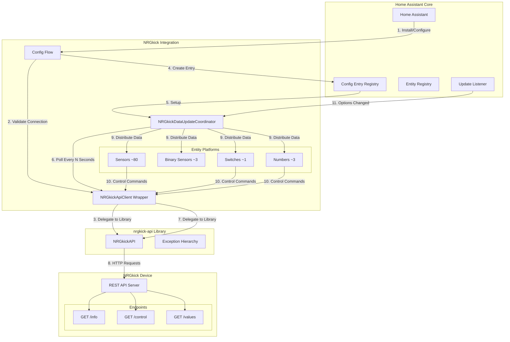
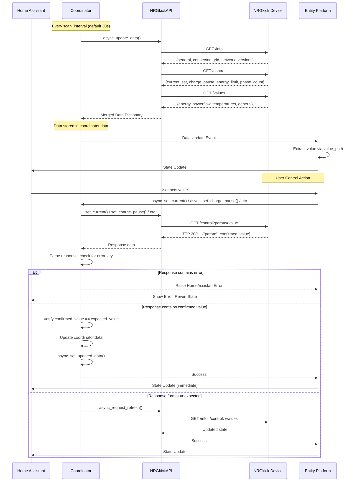
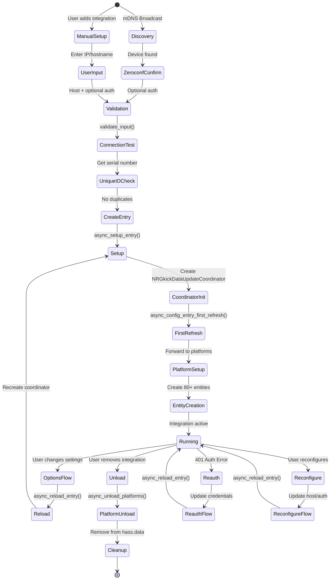
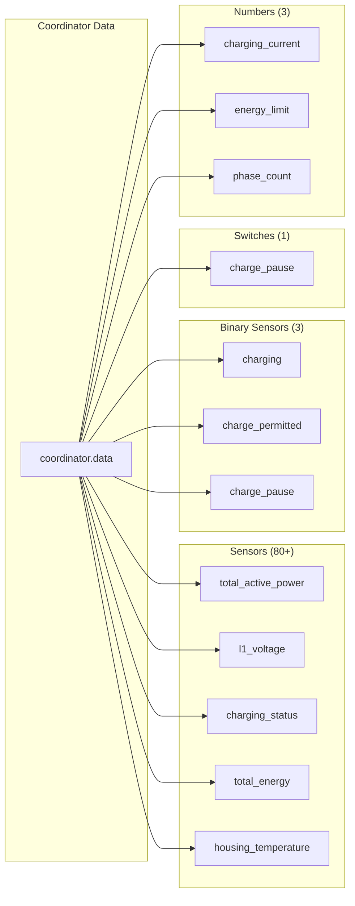
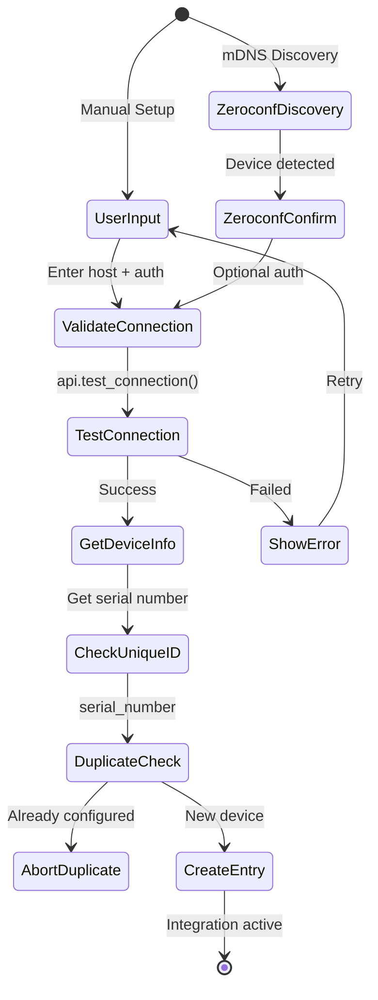
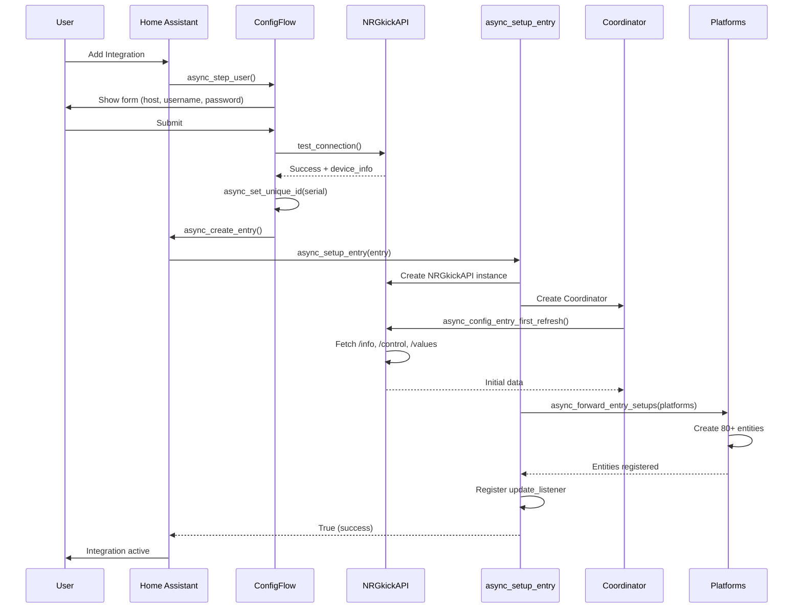
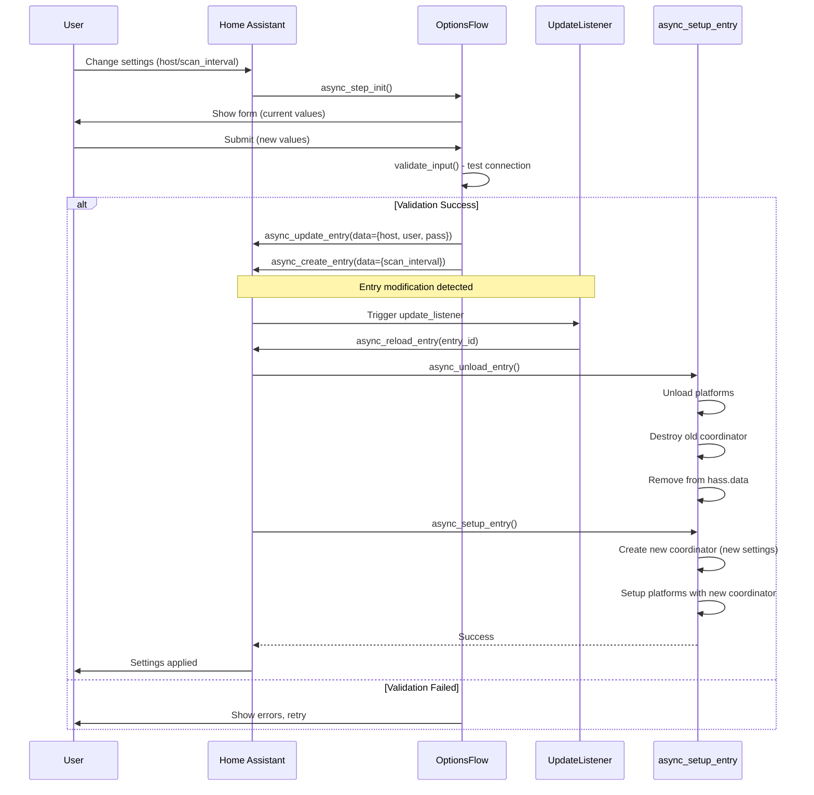

# NRGkick Home Assistant Integration - Architecture Documentation

## Table of Contents

1. [Overview](#overview)
2. [System Architecture](#system-architecture)
3. [Integration Registration & Lifecycle](#integration-registration--lifecycle)
4. [Data Flow & Polling](#data-flow--polling)
5. [Entity Registration & Mapping](#entity-registration--mapping)
6. [Configuration System](#configuration-system)
7. [Home Assistant Event Handling](#home-assistant-event-handling)
8. [UI Integration](#ui-integration)
9. [Code Structure](#code-structure)
10. [Testing Strategy](#testing-strategy)
11. [Key Design Patterns](#key-design-patterns)

---

## Overview

The NRGkick integration is a local polling-based Home Assistant custom component that communicates with NRGkick Gen2 EV charging devices through their HTTP REST JSON API. Core architectural patterns:

- **Config Flow**: UI-based configuration with validation, unique device identification, and comprehensive options management including connection reconfiguration.
- **DataUpdateCoordinator**: Centralized API polling prevents multiple entities from making redundant HTTP requests.
- **Custom Exception Hierarchy**: Typed exceptions (`NRGkickApiClientCommunicationError`, `NRGkickApiClientAuthenticationError`) enable proper error handling and re-authentication flows.
- **Platform Entities**: Implements Home Assistant entity platforms (sensor, binary_sensor, switch, number) to expose device data and controls.
- **Async/Await**: Python's async/await throughout prevents blocking the Home Assistant event loop during network I/O.
- **Zeroconf Discovery**: Automatic device detection via mDNS broadcasts (`_nrgkick._tcp.local.`).

---

## System Architecture

### Two-Layer Design

The integration uses a **two-layer architecture** for better separation of concerns:

1. **nrgkick-api** - Standalone Python library (PyPI) for device communication
   - No Home Assistant dependencies
   - Handles HTTP requests, retries, authentication
   - Library exceptions: `NRGkickError`, `NRGkickConnectionError`, `NRGkickAuthenticationError`

2. **Home Assistant Integration** - Thin wrapper with HA-specific patterns
   - Wraps library with HA session management
   - Translates exceptions to HA types with localization
   - Implements DataUpdateCoordinator, Config Flow, Entity Platforms

This separation enables potential Home Assistant core integration and allows the API library to be used independently in other projects.

### High-Level Component Diagram



### Data Flow Architecture



---

## Integration Registration & Lifecycle

### 1. Entry Point: `manifest.json`

Home Assistant discovers integrations through the `manifest.json` file:

```json
{
  "domain": "nrgkick",
  "name": "NRGkick",
  "config_flow": true,
  "zeroconf": ["_nrgkick._tcp.local."],
  "requirements": ["nrgkick-api==1.0.0"],
  "iot_class": "local_polling"
}
```

**Key Properties:**

- `domain`: Unique identifier for the integration (`"nrgkick"`)
- `config_flow`: Enables UI-based configuration (no manual YAML editing)
- `zeroconf`: Enables automatic discovery via mDNS service `_nrgkick._tcp.local.`
- `requirements`: Python package dependencies - the `nrgkick-api` library handles device communication
- `iot_class`: `local_polling` indicates local network polling (no cloud)

### 2. Integration Lifecycle Flow



### 3. Setup Entry (`__init__.py::async_setup_entry`)

This function is Home Assistant's entry point for setting up the integration after a config entry has been created (either through user configuration or discovery).

```python
async def async_setup_entry(hass: HomeAssistant, entry: ConfigEntry) -> bool:
    """Set up NRGkick from a config entry."""
    # 1. Initialize the domain storage
    hass.data.setdefault(DOMAIN, {})

    # 2. Create API client with stored credentials
    api = NRGkickAPI(
        host=entry.data["host"],
        username=entry.data.get("username"),
        password=entry.data.get("password"),
        session=async_get_clientsession(hass),  # Reuse HA's aiohttp session
    )

    # 3. Create coordinator with configurable scan interval
    coordinator = NRGkickDataUpdateCoordinator(hass, api, entry)

    # 4. Perform first data fetch (raises exception if device unavailable)
    await coordinator.async_config_entry_first_refresh()

    # 5. Store coordinator in entry runtime_data
    entry.runtime_data = coordinator

    # 6. Forward setup to entity platforms (sensor, switch, number, binary_sensor)
    await hass.config_entries.async_forward_entry_setups(entry, PLATFORMS)

    # 7. Register listener for options changes (scan interval updates)
    entry.async_on_unload(entry.add_update_listener(async_reload_entry))

    return True
```

**Integration with Home Assistant:**

1. **Storage in `entry.runtime_data`**: Modern Home Assistant integrations use `entry.runtime_data` instead of `hass.data` for storing integration runtime data. This provides automatic cleanup when the entry is removed and cleaner memory management. The coordinator is stored directly on the config entry object, making it accessible to all entity platforms.

2. **Session Reuse**: `async_get_clientsession(hass)` returns Home Assistant's global aiohttp ClientSession, which maintains a connection pool and reduces overhead compared to creating a new session per integration.

3. **First Refresh Validation**: `async_config_entry_first_refresh()` is a DataUpdateCoordinator method that performs the initial data fetch. If this fails, Home Assistant prevents entity creation and marks the integration as failed setup, avoiding the creation of unavailable entities.

4. **Platform Forwarding**: `async_forward_entry_setups()` delegates setup to each entity platform file (sensor.py, switch.py, etc.). Each platform's `async_setup_entry()` function receives the config entry and can retrieve the coordinator from `hass.data`.

5. **Update Listener**: The update listener is called when the user modifies options (like scan interval). `entry.async_on_unload()` ensures the listener is removed when the integration is unloaded, preventing memory leaks.

---

## Data Flow & Polling

### 1. Coordinator Pattern

The `NRGkickDataUpdateCoordinator` inherits from Home Assistant's `DataUpdateCoordinator` base class, which handles the polling loop, error recovery, and entity notifications:

```python
class NRGkickDataUpdateCoordinator(DataUpdateCoordinator):
    """Class to manage fetching NRGkick data from the API."""

    def __init__(self, hass: HomeAssistant, api: NRGkickAPI, entry: ConfigEntry) -> None:
        # Get scan interval from options (user-configured) or fallback to default
        scan_interval = entry.options.get(
            CONF_SCAN_INTERVAL,
            entry.data.get(CONF_SCAN_INTERVAL, DEFAULT_SCAN_INTERVAL),
        )

        super().__init__(
            hass,
            _LOGGER,
            name=DOMAIN,
            update_interval=timedelta(seconds=scan_interval),  # Configurable polling
        )

    async def _async_update_data(self) -> dict[str, Any]:
        """Update data via library."""
        try:
            # Fetch all three endpoints sequentially
            # Note: These could be parallelized with asyncio.gather() for better performance
            info = await self.api.get_info()
            control = await self.api.get_control()
            values = await self.api.get_values()

            # Return merged data structure
            # This becomes available as coordinator.data to all entities
            return {
                "info": info,
                "control": control,
                "values": values,
            }
        except NRGkickApiClientAuthenticationError as err:
            # ConfigEntryAuthFailed triggers HA's reauth flow
            # User sees notification to reconfigure credentials
            raise ConfigEntryAuthFailed from err
        except NRGkickApiClientCommunicationError as err:
            # UpdateFailed logs the error and schedules retry
            # Entities become unavailable until next successful update
            raise UpdateFailed(f"Error communicating with API: {err}") from err
```

**How the Coordinator Integrates:**

- **Polling Loop**: The base class manages a background task that calls `_async_update_data()` every `update_interval` seconds. We don't need to implement timer logic.

- **Entity Notifications**: When data is successfully fetched, the coordinator automatically notifies all registered `CoordinatorEntity` instances by calling their update methods. This is handled by the base class.

- **Error Handling**: The coordinator catches two types of custom exceptions:
  - `NRGkickApiClientAuthenticationError` → Raises `ConfigEntryAuthFailed` to trigger Home Assistant's re-authentication flow
  - `NRGkickApiClientCommunicationError` → Raises `UpdateFailed` to log the error and retry later

  When errors occur, entities become unavailable until the next successful update.

- **Data Availability**: The returned dictionary is stored in `coordinator.data` and remains available to entities between updates. This allows entities to access the last known good data even if a poll fails.

**Data Structure:**

```python
{
    "info": {
        "general": {"serial_number", "device_name", "model_type", "rated_current"},
        "connector": {"phase_count", "max_current", "type", "serial"},
        "grid": {"voltage", "frequency", "phases"},
        "network": {"ip_address", "mac_address", "ssid", "rssi"},
        "cellular": {"imei", "imsi", "operator", "rssi", "mode"},  # SIM models only
        "gps": {"latitude", "longitude", "altitude", "accuracy"},  # SIM models only
        "versions": {"sw_sm", "hw_sm"}
    },
    "control": {
        "current_set": 16.0,
        "charge_pause": 0,
        "energy_limit": 0,
        "phase_count": 3
    },
    "values": {
        "general": {"status", "charging_rate", "vehicle_connect_time", ...},
        "energy": {"total_charged_energy", "charged_energy"},
        "powerflow": {"total_active_power", "l1": {...}, "l2": {...}, "l3": {...}},
        "temperatures": {"housing", "connector_l1", "connector_l2", "connector_l3"}
    }
}
```

### 2. API Client Architecture

The integration uses a two-layer design for the API client:

#### Library Layer (`nrgkick-api` PyPI package)

The standalone `NRGkickAPI` class encapsulates all HTTP communication with the device:

```python
# nrgkick-api library (nrgkick_api.api)
from nrgkick_api import NRGkickAPI, NRGkickError, NRGkickConnectionError, NRGkickAuthenticationError

class NRGkickAPI:
    def __init__(self, host: str, username: str | None = None,
                 password: str | None = None,
                 session: aiohttp.ClientSession | None = None):
        self.host = host
        self._session = session or aiohttp.ClientSession()
        # ...

    async def _request(self, endpoint: str, params: dict | None = None) -> dict:
        """Make a request with automatic retry and optional BasicAuth."""
        # Retry loop for transient errors (max 3 attempts)
        # Exponential backoff (1.5^attempt)
        # Raises library-specific exceptions
        ...
```

**Library Exceptions:**

- `NRGkickError` - Base exception
- `NRGkickConnectionError` - Network issues, timeouts
- `NRGkickAuthenticationError` - Invalid credentials (401/403)

#### Integration Wrapper (`api.py`)

The integration provides a thin wrapper that translates library exceptions to Home Assistant exceptions with localization support:

```python
# custom_components/nrgkick/api.py
from nrgkick_api import NRGkickAPI as LibraryAPI
from nrgkick_api import NRGkickConnectionError, NRGkickAuthenticationError

class NRGkickApiClientError(HomeAssistantError):
    """Base exception for NRGkick API client errors."""

class NRGkickApiClientCommunicationError(NRGkickApiClientError):
    """Exception to indicate communication errors."""

class NRGkickApiClientAuthenticationError(NRGkickApiClientError):
    """Exception to indicate authentication errors."""

class NRGkickApiClient:
    """Wrapper around nrgkick-api library for Home Assistant."""

    def __init__(self, host: str, username: str | None, password: str | None,
                 session: aiohttp.ClientSession):
        self._api = LibraryAPI(host, username, password, session)

    async def get_info(self) -> dict:
        """Get device info with HA exception translation."""
        try:
            return await self._api.get_info()
        except NRGkickAuthenticationError as err:
            raise NRGkickApiClientAuthenticationError(
                translation_domain=DOMAIN,
                translation_key="authentication_failed",
            ) from err
        except NRGkickConnectionError as err:
            raise NRGkickApiClientCommunicationError(
                translation_domain=DOMAIN,
                translation_key="connection_failed",
            ) from err
```

````

**Design Considerations:**

- **Two-Layer Architecture**: The API client is split into a standalone library (`nrgkick-api`) and a Home Assistant wrapper (`api.py`). This enables:
  - Potential Home Assistant core integration (requires PyPI library)
  - Independent use of the library in other projects
  - Clean separation between device communication and HA-specific concerns

- **Automatic Retry Logic**: The library implements intelligent retry behavior for transient errors:
  - **Retries up to 3 times** with exponential backoff (base 1.5s: delays of 0s → 1.5s → 2.25s)
  - **Retries on**: Timeouts, HTTP 500-504 (server errors), connection errors
  - **No retry on**: Authentication errors (401/403), client errors (4xx), successful responses
  - **Smart detection**: Distinguishes between transient issues (network glitches) and permanent failures (bad credentials)

- **Exponential Backoff**: Wait time increases exponentially (1.5^attempt) to avoid overwhelming a struggling device while still recovering quickly from brief network hiccups.

- **Exception Translation**: The wrapper translates library exceptions to HA exceptions:
  - `NRGkickAuthenticationError` → `NRGkickApiClientAuthenticationError` (triggers reauth flow)
  - `NRGkickConnectionError` → `NRGkickApiClientCommunicationError` (entities unavailable)
  - All HA exceptions support translation keys for localized error messages

- **Session Management**: The wrapper uses `async_get_clientsession(hass)` to leverage Home Assistant's connection pooling. The library accepts the session as a parameter.

- **Timeout Handling**: The library uses 10-second timeouts per request. If the timeout expires, it's caught and converted to `NRGkickConnectionError`.

- **Response-First Error Handling**: The library reads JSON response before checking HTTP status. This allows extraction of device error messages from HTTP error responses.

**Read Operations:**

- `get_info(sections)` → `GET /info?general=1&network=1&...`
- `get_control()` → `GET /control`
- `get_values(sections)` → `GET /values?energy=1&powerflow=1&...`

**Write Operations (Control Commands):**

- `set_current(16.0)` → `GET /control?current_set=16.0`
- `set_charge_pause(True)` → `GET /control?charge_pause=1`
- `set_energy_limit(5000)` → `GET /control?energy_limit=5000`
- `set_phase_count(3)` → `GET /control?phase_count=3`

### 3. Polling Cycle Timing

```mermaid
gantt
    title Polling Timeline (scan_interval = 30s)
    dateFormat s
    axisFormat %Ss

    section Coordinator
    Poll Request     :a1, 0, 1s
    API Calls        :a2, after a1, 3s
    Data Processing  :a3, after a2, 1s
    Entity Updates   :a4, after a3, 1s
    Idle Time        :a5, after a4, 24s
    Poll Request     :a6, after a5, 1s

    section Entities
    Receive Update   :b1, 5, 1s
    State Update     :b2, after b1, 1s
    HA UI Refresh    :b3, after b2, 1s
````

**Polling Cycle Breakdown:**

- **0-1s**: Coordinator initiates poll request
- **1-4s**: Three HTTP requests to device (`/info`, `/control`, `/values`)
- **4-5s**: Process and merge JSON responses
- **5-6s**: Notify all entities of data update
- **6-7s**: Entities extract values and update state
- **7-30s**: Idle period until next scan interval
- **30s**: Next poll cycle begins

**Scan Interval Configuration:**

- Default: 30 seconds (`DEFAULT_SCAN_INTERVAL`)
- Range: 10-300 seconds (`MIN_SCAN_INTERVAL` to `MAX_SCAN_INTERVAL`)
- User-configurable via Options Flow
- Changes trigger automatic coordinator reload

---

## Entity Registration & Mapping

### 1. Platform Setup Pattern

Each entity platform file implements `async_setup_entry()`, which Home Assistant calls during the forwarding phase. The pattern is consistent across all platforms:

```python
async def async_setup_entry(
    hass: HomeAssistant,
    entry: ConfigEntry,
    async_add_entities: AddEntitiesCallback,
) -> None:
    """Set up NRGkick sensors based on a config entry."""
    # 1. Get coordinator from entry runtime_data
    coordinator: NRGkickDataUpdateCoordinator = entry.runtime_data

    # 2. Create entity instances with value_path configuration
    entities = [
        NRGkickSensor(
            coordinator,
            key="total_active_power",
            unit=UnitOfPower.WATT,
            device_class=SensorDeviceClass.POWER,
            state_class=SensorStateClass.MEASUREMENT,
            value_path=["values", "powerflow", "total_active_power"],
            precision=2,
        ),
        # ... 80+ more sensors
    ]

    # 3. Register entities with Home Assistant
    async_add_entities(entities)
```

**Platform Integration:**

- **Parallel Updates**: `PARALLEL_UPDATES` is set to 0 in all platforms. Since the `DataUpdateCoordinator` handles all data fetching centrally, individual entities do not need to poll the device. This setting disables Home Assistant's default parallel update logic, ensuring efficient resource usage.

- **Coordinator Retrieval**: Each platform retrieves the coordinator from `entry.runtime_data`. This is the same coordinator instance created in `async_setup_entry()`.

- **Base Class Inheritance**: All entity classes inherit from `NRGkickEntity`, which provides common device info setup and proper type annotation for the coordinator.

- **Entity Registration**: `async_add_entities()` is a callback provided by Home Assistant. It adds entities to the entity registry and starts their lifecycle. Once registered, entities begin receiving updates when the coordinator fetches new data.

- **Declarative Configuration**: Entity definitions use a declarative approach with `value_path` arrays. This separates data mapping from entity logic, making it easier to add new entities without writing custom property methods.

### 2. Value Path Mapping System

Rather than hard-coding data access in each entity's properties, the integration uses a generic path-based system to navigate the nested data structure:

```python
value_path = ["values", "powerflow", "l1", "voltage"]
# Maps to: coordinator.data["values"]["powerflow"]["l1"]["voltage"]
```

**Entity Value Extraction:**

Each sensor implements `native_value` property, which Home Assistant calls to get the current state:

```python
@property
def native_value(self) -> float | int | str | None:
    """Return the state of the sensor."""
    data = self.coordinator.data
    for key in self._value_path:
        if data is None:
            return None
        data = data.get(key)  # Traverse the nested dictionary

    # Optional transformation function
    if self._value_fn and data is not None:
        return self._value_fn(data)
    return data
```

**How This Works:**

1. **CoordinatorEntity Inheritance**: By inheriting from `CoordinatorEntity`, the sensor automatically gets a reference to `self.coordinator`, and Home Assistant calls `native_value` whenever the coordinator updates.

2. **Path Traversal**: The loop iterates through `_value_path`, treating each element as a dictionary key. This safely navigates nested structures without raising KeyError if intermediate keys are missing.

3. **Null Safety**: If any intermediate value is None or missing, the function returns None early, causing the entity to report as unavailable in Home Assistant.

4. **Value Transformation**: The optional `_value_fn` lambda allows post-processing, such as mapping status codes to human-readable strings using `STATUS_MAP`.

**Example with Transformation:**

```python
NRGkickSensor(
    coordinator,
    key="status",
    value_path=["values", "general", "status"],
    value_fn=lambda x: STATUS_MAP.get(x, "Unknown"),  # Convert 3 → "Charging"
)
```

### 3. Entity Platform Distribution



**Entity Counts:**

- **Sensors (80+)**: Read-only data display
  - Power & Energy (8): Total power, per-phase power, energy counters
  - Electrical Values (18): L1/L2/L3 voltage, current, power factor
  - Temperatures (6): Housing, connector pins, domestic plugs
  - Device Info (10+): Network, versions, connector details
  - Status (10+): Charging state, warnings, errors, timers

- **Binary Sensors (3)**: Boolean states
  - Charging (device_class: `battery_charging`)
  - Charge Permitted (device_class: `power`)
  - Charge Pause (no device class)

- **Switches (1)**: Toggle control
  - Charge Pause (icon: `mdi:pause`)

- **Numbers (3)**: Numeric input controls
  - Charging Current (6-32A, slider)
  - Energy Limit (0-100,000 Wh, box)
  - Phase Count (1-3, slider)

### 4. Device Registry Integration

Home Assistant's device registry groups entities by device. The `NRGkickEntity` base class provides device info for all entity types:

```python
class NRGkickEntity(CoordinatorEntity[NRGkickDataUpdateCoordinator]):
    """Base class for NRGkick entities."""

    _attr_has_entity_name = True

    def __init__(self, coordinator: NRGkickDataUpdateCoordinator, key: str) -> None:
        """Initialize NRGkick entity."""
        super().__init__(coordinator)
        self._key = key
        self._attr_translation_key = key
        self._setup_device_info()

    @property
    def suggested_object_id(self) -> str | None:
        """Return the suggested object ID for this entity.

        Ensures entity_ids are always English-based regardless of
        user language, while translation_key provides localized names.
        """
        return self._key

    def _setup_device_info(self) -> None:
        """Set up device info and unique ID."""
        data = self.coordinator.data
        info_data: dict[str, Any] = data.get("info", {}) if data else {}
        device_info: dict[str, Any] = info_data.get("general", {})
        serial: str = device_info.get("serial_number", "unknown")

        device_name: str | None = device_info.get("device_name")
        if not device_name:
            device_name = "NRGkick"

        versions: dict[str, Any] = info_data.get("versions", {})
        self._attr_unique_id = f"{serial}_{self._key}"
        self._attr_device_info = DeviceInfo(
            identifiers={(DOMAIN, serial)},
            name=device_name,
            manufacturer="DiniTech",
            model=device_info.get("model_type", "NRGkick Gen2"),
            sw_version=versions.get("sw_sm"),
        )
```

**Device Registry Behavior:**

- **Base Class Pattern**: All entity types (sensor, binary_sensor, switch, number) inherit from `NRGkickEntity`, eliminating duplicate device info setup.

- **Modern Entity Naming (`has_entity_name = True`)**: Modern Home Assistant integrations use `has_entity_name = True`, which enables automatic device-based entity naming. The `translation_key` provides localized display names via the `translations/` directory, while `suggested_object_id` ensures entity IDs remain English-based regardless of user language (e.g., `sensor.nrgkick_total_active_power` with German display name "Gesamte Wirkleistung").

- **Type Annotation**: The `coordinator: NRGkickDataUpdateCoordinator` annotation enables proper type inference throughout the entity hierarchy.

- **Device Name Fallback**: If the device API returns an empty device name, the integration defaults to "NRGkick" to ensure entity IDs are always generated consistently (e.g., `sensor.nrgkick_total_active_power`).

- **Identifier Matching**: Home Assistant uses the `identifiers` tuple to determine if entities belong to the same device. All entities use `(DOMAIN, serial_number)`, so they automatically group together.

- **Entity Organization**: In the Home Assistant UI, users see one device (e.g., "NRGkick ABC123") with 80+ entities underneath, rather than 80+ separate devices.

- **Lifecycle Coupling**: When the integration is removed, Home Assistant automatically removes the device and all associated entities from the registry.

---

## Configuration System

### 1. Configuration Flow (`config_flow.py`)

The config flow implements Home Assistant's UI-based configuration system. It's a state machine where each step (method prefixed with `async_step_`) handles user input and transitions to the next state:



**User Input Schema:**

```python
STEP_USER_DATA_SCHEMA = vol.Schema({
    vol.Required(CONF_HOST): str,               # IP or hostname
    vol.Optional(CONF_USERNAME): str,           # Optional BasicAuth
    vol.Optional(CONF_PASSWORD): str,
})
```

**Validation Function:**

Validation is separated into its own function for reuse between manual setup and options flow:

```python
async def validate_input(hass: HomeAssistant, data: dict) -> dict:
    """Validate the user input allows us to connect."""
    api = NRGkickAPI(host=data[CONF_HOST], ...)

    # Test connection - raises custom exceptions
    await api.test_connection()

    # Fetch device info for unique ID
    info = await api.get_info(["general"])

    return {
        "title": info["general"]["device_name"],
        "serial": info["general"]["serial_number"],  # Used as unique_id
    }
```

**Config Flow Integration Points:**

1. **Exception Handling**: Custom exceptions (`NRGkickApiClientCommunicationError`, `NRGkickApiClientAuthenticationError`) are caught in `async_step_user()` and converted to error keys. Home Assistant looks up these keys in the `translations/` directory to display localized error messages.

2. **Unique ID System**: `async_set_unique_id()` registers the device's serial number with Home Assistant. This prevents duplicate config entries for the same device and enables IP address updates during discovery.

3. **Entry Creation**: `async_create_entry()` stores the validated data in Home Assistant's config storage and triggers `async_setup_entry()`. The config flow instance is then destroyed.

### 2. Zeroconf Discovery

Home Assistant automatically calls `async_step_zeroconf()` when it detects an mDNS service matching the types listed in `manifest.json`. The integration uses the modern import path for `ZeroconfServiceInfo`:

```python
from homeassistant.helpers.service_info.zeroconf import ZeroconfServiceInfo

async def async_step_zeroconf(self, discovery_info: ZeroconfServiceInfo) -> ConfigFlowResult:
    """Handle zeroconf discovery."""
    # Extract mDNS metadata
    serial = discovery_info.properties.get("serial_number")
    device_name = discovery_info.properties.get("device_name", "NRGkick")
    json_api_enabled = discovery_info.properties.get("json_api_enabled", "0")

    # Verify JSON API is enabled
    if json_api_enabled != "1":
        return self.async_abort(reason="json_api_disabled")

    # Set unique ID to prevent duplicate entries
    await self.async_set_unique_id(serial)

    # If already configured, update the host (IP might have changed)
    self._abort_if_unique_id_configured(updates={CONF_HOST: discovery_info.host})

    # Store discovery info and proceed to confirmation step
    self._discovered_host = discovery_info.host
    self._discovered_name = device_name
    return await self.async_step_zeroconf_confirm()
```

**Discovery Integration:**

- **Import Path**: Uses `homeassistant.helpers.service_info.zeroconf.ZeroconfServiceInfo` for Zeroconf service information.

- **Service Matching**: Home Assistant's Zeroconf component listens for mDNS broadcasts. When it sees `_nrgkick._tcp.local.`, it instantiates a ConfigFlow and calls `async_step_zeroconf()` with service info.

- **Property Extraction**: The device broadcasts TXT records as key-value pairs in `discovery_info.properties`. These are parsed as strings, so boolean checks compare against "0" or "1".

- **Duplicate Prevention**: `_abort_if_unique_id_configured()` checks if the serial number already exists. If found, it can optionally update stored data (like the host field if the IP changed via DHCP).

- **User Confirmation**: Discovered devices still require user confirmation via `async_step_zeroconf_confirm()`, where optional authentication credentials can be entered.

**Broadcasted mDNS Properties:**

- `serial_number`: Device serial (unique ID)
- `device_name`: User-configured name
- `model_type`: "NRGkick Gen2"
- `json_api_enabled`: "0" or "1"

### 3. Options Flow (Preferences)

The `OptionsFlowHandler` class allows users to modify runtime preferences (scan interval) without affecting connection settings.

```python
class OptionsFlowHandler(config_entries.OptionsFlow):
    """Handle options flow for NRGkick."""

    async def async_step_init(self, user_input: dict | None = None) -> ConfigFlowResult:
        """Manage the options."""
        if user_input is not None:
            return self.async_create_entry(title="", data=user_input)

        return self.async_show_form(
            step_id="init",
            data_schema=vol.Schema({
                vol.Required(
                    CONF_SCAN_INTERVAL,
                    default=self.config_entry.options.get(
                        CONF_SCAN_INTERVAL, DEFAULT_SCAN_INTERVAL
                    ),
                ): vol.All(vol.Coerce(int), vol.Range(min=MIN_SCAN_INTERVAL, max=MAX_SCAN_INTERVAL)),
            }),
        )
```

**Options Flow Pattern:**

1.  **Preference Management**: Handles settings that don't affect API connectivity, like `scan_interval`.
2.  **Automatic Reload**: Returning `async_create_entry()` triggers the update listener, which reloads the integration to apply the new scan interval.

### 4. Reconfiguration Flow

The integration supports Home Assistant's native reconfiguration flow for updating connection details (host, username, password) if the device IP changes or credentials are updated.

```python
async def async_step_reconfigure(self, user_input: dict[str, Any] | None = None) -> ConfigFlowResult:
    """Handle reconfiguration."""
    # 1. Pre-fill form with current values
    return self.async_show_form(
        step_id="reconfigure_confirm",
        data_schema=vol.Schema({
            vol.Required(CONF_HOST, default=self._reconfigure_entry.data[CONF_HOST]): str,
            # ... auth fields
        }),
    )

async def async_step_reconfigure_confirm(self, user_input: dict[str, Any] | None = None) -> ConfigFlowResult:
    """Handle reconfiguration confirmation."""
    # 2. Validate new connection details
    # 3. Update entry and reload
    return self.async_update_reload_and_abort(
        self._reconfigure_entry,
        data={...},
        reason="reconfigure_successful",
    )
```

**Reconfiguration vs. Options:**

- **Reconfigure Flow**: Updates `entry.data` (connection settings). Critical for connectivity.
- **Options Flow**: Updates `entry.options` (preferences). Tunable parameters.

### 5. Configuration Storage

Home Assistant stores configuration in two locations:

**`entry.data` (Connection Settings):**

```json
{
  "host": "192.168.1.100",
  "username": "admin",
  "password": "secret"
}
```

**`entry.options` (User Preferences):**

```json
{
  "scan_interval": 30
}
```

**Retrieval with Fallbacks:**

The coordinator constructor retrieves the scan interval with a multi-level fallback:

```python
scan_interval = entry.options.get(
    CONF_SCAN_INTERVAL,                      # First: check options
    entry.data.get(                          # Second: check data
        CONF_SCAN_INTERVAL,
        DEFAULT_SCAN_INTERVAL                # Third: use default (30s)
    )
)
```

This pattern handles three scenarios:

1. **Normal Case**: After first configuration with options flow, value is in `entry.options`
2. **Legacy Case**: Old installations might have stored it in `entry.data` before options flow existed
3. **Initial Setup**: Newly created entries use the hardcoded default until user changes it

---

## Home Assistant Event Handling

### 1. Installation Flow



### 2. Update/Reload Flow



**Update Listener Mechanism:**

The update listener is registered during initial setup:

```python
# In async_setup_entry()
entry.async_on_unload(entry.add_update_listener(async_reload_entry))

async def async_reload_entry(hass: HomeAssistant, entry: ConfigEntry) -> None:
    """Reload config entry when options change."""
    await hass.config_entries.async_reload(entry.entry_id)
```

**Flow Details:**

1. **Listener Registration**: During `async_setup_entry()`, the integration calls `entry.add_update_listener(callback)` to register a callback function. This callback is invoked whenever `entry.data` or `entry.options` changes.

2. **Memory Management**: Wrapping with `entry.async_on_unload()` ensures the listener is automatically removed when the integration unloads, preventing memory leaks from orphaned callback references.

3. **Trigger Conditions**: The listener fires when:
   - Options flow calls `async_create_entry()` (updates `entry.options`)
   - Options flow calls `async_update_entry()` (updates `entry.data`)
   - Any code modifies the entry (including discovery IP updates)

4. **Reload Process**: `async_reload()` is Home Assistant's standard method that:
   - Calls `async_unload_entry()` to clean up current state
   - Waits for unload completion
   - Calls `async_setup_entry()` to recreate with new config

5. **State Preservation**: Entity IDs and unique IDs persist across reloads, so historical data in the recorder database remains linked. From the user's perspective, entities briefly show as unavailable during the reload (typically 1-2 seconds).

6. **Coordinator Lifecycle**: The old coordinator's `__del__` method (triggered by garbage collection) cancels its background polling task. The new coordinator starts fresh with updated `scan_interval` from the new entry.

### 3. Uninstallation Flow

Home Assistant calls this function when the user removes the integration:

```python
async def async_unload_entry(hass: HomeAssistant, entry: ConfigEntry) -> bool:
    """Unload a config entry."""
    return await hass.config_entries.async_unload_platforms(entry, PLATFORMS)
```

**Cleanup Process:**

1. **Platform Unloading**: `async_unload_platforms()` calls each platform's cleanup code. For entities inheriting from `CoordinatorEntity`, this automatically unsubscribes them from coordinator updates.

2. **Coordinator Destruction**: With the `runtime_data` pattern, Home Assistant automatically clears the coordinator reference when the entry is unloaded. Python's garbage collector then destroys the coordinator, which cancels its background polling task. This eliminates the need for manual cleanup that was required with older `hass.data` storage patterns.

3. **Session Management**: The aiohttp session is owned by Home Assistant (passed via `async_get_clientsession()`), so we don't close it. Home Assistant manages the session lifecycle globally.

4. **Entity Registry**: Home Assistant automatically removes entities from its registry when their platform is unloaded. Entity state is lost but historical data in the recorder database remains.

5. **Error Handling**: If unloading fails (returns False), Home Assistant marks the integration as failed unload and may leave it partially active. This is rare but can happen if entities have pending operations.

### 4. Reauthentication Flow

Home Assistant's reauth flow is triggered when the coordinator raises `ConfigEntryAuthFailed`. This exception type signals that credentials are invalid rather than a temporary network error:

```python
from homeassistant.exceptions import ConfigEntryAuthFailed
from .api import NRGkickApiClientAuthenticationError

async def _async_update_data(self) -> dict:
    try:
        # Fetch data from all API endpoints
        info = await self.api_client.get_info()
        control = await self.api_client.get_control()
        values = await self.api_client.get_values()
        return {**info, **control, **values}
    except NRGkickApiClientAuthenticationError as err:
        # Triggers reauth flow in UI
        raise ConfigEntryAuthFailed(
            "Authentication failed. Please reconfigure the integration "
            "with valid credentials."
        ) from err
```

**Reauth Flow Implementation:**

The config flow implements reauth using the `async_update_reload_and_abort()` helper method:

```python
async def async_step_reauth_confirm(
    self, user_input: dict[str, Any] | None = None
) -> ConfigFlowResult:
    """Handle reauthentication confirmation."""
    errors: dict[str, str] = {}

    if user_input is not None:
        entry_id = self.context.get("entry_id")
        if not entry_id:
            return self.async_abort(reason="reauth_failed")

        entry = self.hass.config_entries.async_get_entry(entry_id)
        if entry is None:
            return self.async_abort(reason="reauth_failed")

        data = {
            CONF_HOST: entry.data[CONF_HOST],
            CONF_USERNAME: user_input.get(CONF_USERNAME),
            CONF_PASSWORD: user_input.get(CONF_PASSWORD),
        }

        try:
            await validate_input(self.hass, data)
        except NRGkickApiClientAuthenticationError:
            errors["base"] = "invalid_auth"
        except NRGkickApiClientCommunicationError:
            errors["base"] = "cannot_connect"
        except Exception:
            errors["base"] = "unknown"
        else:
            # Use helper method for atomic update + reload + abort
            return self.async_update_reload_and_abort(
                entry, data=data, reason="reauth_successful"
            )

    return self.async_show_form(
        step_id="reauth_confirm",
        data_schema=vol.Schema({
            vol.Optional(CONF_USERNAME): str,
            vol.Optional(CONF_PASSWORD): str,
        }),
        errors=errors,
    )
```

**Reauth Flow Sequence:**

1. **Error Detection**: During coordinator's `_async_update_data()`, the API client raises `NRGkickApiClientAuthenticationError` when it receives 401 or 403 HTTP status codes from the device. The coordinator catches this specific exception type and re-raises it as `ConfigEntryAuthFailed`, which Home Assistant recognizes as an authentication failure (not a transient network error).

2. **UI Notification**: Home Assistant catches `ConfigEntryAuthFailed` and displays a persistent notification in the UI with a "Reconfigure" button. The integration continues running but all entities show as unavailable because the coordinator can't fetch data without valid credentials.

3. **Reauth Flow Initiation**: When the user clicks "Reconfigure", Home Assistant creates a new ConfigFlow instance with context `{"source": SOURCE_REAUTH, "entry_id": <id>}`. The config flow's `async_step_reauth()` method is called, which immediately delegates to `async_step_reauth_confirm()` to show the credential input form.

4. **Credential Validation**: After the user submits new credentials, `validate_input()` tests them against the device. If authentication still fails, the form is redisplayed with an error message. If validation succeeds, the flow proceeds to update the config entry.

5. **Atomic Update with Helper Method**: The `async_update_reload_and_abort()` helper method performs three operations atomically:
   - Updates `entry.data` with new credentials
   - Schedules an entry reload (creates new coordinator with new credentials)
   - Aborts the flow with reason "reauth_successful"

   This replaces the manual pattern of calling `async_update_entry()` followed by `async_reload()`, which could have race conditions if the reload started before the update completed.

6. **Why Use the Helper Method**: The helper method provides several advantages:
   - **Atomicity**: Ensures the entry is updated before reload begins
   - **Error Handling**: Properly handles edge cases like the entry being deleted during reauth
   - **Consistency**: Matches patterns used across Home Assistant integrations
   - **Maintainability**: If Home Assistant changes reload semantics, the helper method is updated automatically

7. **Coordinator Recreation**: The reload process unloads all platforms, destroys the old coordinator (which was failing with auth errors), creates a new coordinator instance with the updated credentials from `entry.data`, performs the first data fetch to verify the new credentials work, and recreates all entities. If the first fetch succeeds, entities become available again. If it fails, the reauth flow triggers again.

**Comparison with Options Flow:**

Both flows update `entry.data` and trigger reloads, but they serve different purposes:

- **Options Flow**: User-initiated changes to any setting (host, credentials, scan interval). Returns `async_create_entry()` which triggers the update listener.
- **Reauth Flow**: System-initiated (triggered by 401/403 errors). Uses `async_update_reload_and_abort()` to atomically update and reload without relying on update listeners.

The reauth flow is more explicit about reload timing because authentication failures require immediate handling, while options changes can tolerate slight delays from the update listener mechanism.

---

## UI Integration

### 1. Translation System

The integration uses translation keys for entity names:

```python
@property
def translation_key(self) -> str:
    """Return the translation key to translate the entity's name and states."""
    return f"nrgkick_{self._key}"
```

**Translation Files:**

- `translations/en.json` (English - fallback)
- `translations/de.json` (German)

**Example Translation:**

```json
{
  "entity": {
    "sensor": {
      "nrgkick_total_active_power": {
        "name": "Total Active Power"
      },
      "nrgkick_charging_status": {
        "name": "Charging Status",
        "state": {
          "unknown": "Unknown",
          "standby": "Standby",
          "connected": "Connected",
          "charging": "Charging",
          "error": "Error",
          "wakeup": "Wakeup"
        }
      }
    }
  }
}
```

### 2. Entity Customization Features

**Display Precision:**

```python
NRGkickSensor(
    ...,
    precision=2,  # Display 2 decimal places (e.g., 16.25 A)
)
# Sets: self._attr_suggested_display_precision = 2
```

**Unit Conversion Hints:**

```python
NRGkickSensor(
    ...,
    unit=UnitOfEnergy.WATT_HOUR,
    suggested_unit=UnitOfEnergy.KILO_WATT_HOUR,  # Suggest kWh instead of Wh
)
```

**Entity Disabling:**

```python
NRGkickSensor(
    ...,
    enabled_default=False,  # Hidden by default (e.g., version sensors)
)
```

**Device Classes:**

```python
NRGkickSensor(
    ...,
    device_class=SensorDeviceClass.POWER,      # Power icon + unit standardization
    state_class=SensorStateClass.MEASUREMENT,  # Enables statistics/graphs
)
```

### 3. Control Entity Behavior

Number entities and switches must handle user input and send control commands to the device:

**Number Entity (Slider vs. Box):**

```python
NRGkickNumber(
    ...,
    mode=NumberMode.SLIDER,  # Slider UI (for current: 6-32A)
)

NRGkickNumber(
    ...,
    mode=NumberMode.BOX,  # Text input box (for energy limit: 0-100,000 Wh)
)
```

**Command Execution with Response Verification:**

Control entities delegate to coordinator methods that handle both execution and verification:

```python
async def async_set_native_value(self, value: float) -> None:
    """Set the value of the number entity."""
    await self.coordinator.async_set_current(value)
    # Coordinator handles: API call → parse response → verify → update state
```

**Coordinator Command Pattern:**

The coordinator implements a helper method that eliminates code duplication across all four control commands:

```python
async def _async_execute_command_with_verification(
    self,
    command_func: Callable[[], Awaitable[dict[str, Any]]],
    expected_value: Any,
    control_key: str,
    error_message: str,
) -> None:
    """Execute command and verify response."""
    # Execute API call and get response
    response = await command_func()

    # Check if response contains error message
    if "Response" in response:
        raise NRGkickApiClientCommunicationError(
            f"{error_message} {response['Response']}"
        )

    # Verify device returned the expected value
    if control_key in response:
        actual_value = response[control_key]
        if float(actual_value) != float(expected_value):
            raise NRGkickApiClientCommunicationError(
                f"{error_message} Device returned unexpected value: "
                f"{actual_value} (expected {expected_value})."
            )

        # Update coordinator data immediately
        self.data["control"][control_key] = actual_value
    else:
        # Fallback: refresh to get current state
        await asyncio.sleep(2)
        await self.async_request_refresh()
```

All four control methods (`async_set_current`, `async_set_charge_pause`, `async_set_energy_limit`, `async_set_phase_count`) use this helper with lambda functions to wrap their API calls.

**Why This Pattern:**

1. **API Response Format**: The device's control API returns different responses:
   - **Success**: `{"current_set": 6.7}` - Returns the new value directly
   - **Error**: `{"Response": "Charging pause is blocked by solar-charging"}` - Returns error message

2. **Immediate Verification**: The response contains the actual applied value, so no delay/refresh is needed in the success case. This makes the UI update instantly.

3. **Error Detection**: By checking for the `"Response"` key, we can detect and report device-side errors (like solar charging blocking commands) with the actual error message from the device.

4. **State Consistency**: The coordinator immediately updates its data with the response value, ensuring the UI shows the correct state without waiting for the next polling cycle.

5. **Code Reuse**: The helper method eliminates duplication across all four control methods. Changes to verification logic only need to be made in one place.

6. **Fallback Support**: If the response doesn't contain the expected key (unexpected API behavior), the system falls back to the old refresh-based verification.

7. **User Feedback**: If verification fails, entities catch the exception and display an error notification with the device's actual error message (e.g., "blocked by solar-charging").

### 4. Lovelace Dashboard Integration

Example dashboard configuration (from `examples/lovelace_cards.yaml`):

```yaml
type: entities
title: NRGkick Charging
entities:
  - entity: sensor.nrgkick_charging_status
  - entity: sensor.nrgkick_total_active_power
  - entity: sensor.nrgkick_current_session_energy
  - entity: number.nrgkick_charging_current
  - entity: switch.nrgkick_charge_pause
```

---

## Code Structure

### File Organization

```
custom_components/nrgkick/
├── __init__.py                 # Entry point, setup/teardown
├── coordinator.py              # DataUpdateCoordinator, base entity class
├── api.py                      # HTTP client, API methods
├── config_flow.py              # UI configuration, validation, options
├── const.py                    # Constants (domain, status map, intervals)
├── icons.json                  # Default icon mapping
├── manifest.json               # Integration metadata
│
├── sensor.py                   # 80+ sensor entities
├── binary_sensor.py            # 3 binary sensor entities
├── switch.py                   # 1 switch entity (charge pause)
├── number.py                   # 3 number entities (current, limit, phases)
│
├── diagnostics.py              # Diagnostics data provider
└── translations/               # Entity name translations
    ├── en.json
    └── de.json
```

### Responsibility Matrix

| File               | Responsibilities                                | Dependencies                           |
| ------------------ | ----------------------------------------------- | -------------------------------------- |
| `__init__.py`      | Integration setup/teardown, platform forwarding | `api.py`, `coordinator.py`             |
| `coordinator.py`   | DataUpdateCoordinator, NRGkickEntity base class | `api.py`, `const.py`                   |
| `api.py`           | HTTP client, REST API calls, connection testing | `aiohttp`                              |
| `config_flow.py`   | UI configuration, validation, discovery, reauth | `api.py`, `const.py`                   |
| `const.py`         | Constants, status map, configuration keys       | None                                   |
| `sensor.py`        | 80+ sensor entity definitions, value mapping    | `coordinator.py`, `const.py`           |
| `binary_sensor.py` | 3 binary sensor entities                        | `coordinator.py`, `const.py`           |
| `switch.py`        | 1 switch entity (charge pause control)          | `coordinator.py`, `const.py`, `api.py` |
| `number.py`        | 3 number entities (control inputs)              | `coordinator.py`, `const.py`, `api.py` |

### Key Constants (`const.py`)

```python
# Integration identifier
DOMAIN: Final = "nrgkick"

# Configuration keys
CONF_SCAN_INTERVAL: Final = "scan_interval"

# Scan interval limits (seconds)
DEFAULT_SCAN_INTERVAL: Final = 30
MIN_SCAN_INTERVAL: Final = 10
MAX_SCAN_INTERVAL: Final = 300

# API endpoints
ENDPOINT_INFO: Final = "/info"
ENDPOINT_CONTROL: Final = "/control"
ENDPOINT_VALUES: Final = "/values"

# Device status codes
STATUS_UNKNOWN: Final = 0
STATUS_STANDBY: Final = 1
STATUS_CONNECTED: Final = 2
STATUS_CHARGING: Final = 3
STATUS_ERROR: Final = 6
STATUS_WAKEUP: Final = 7

STATUS_MAP: Final = {
    0: "Unknown",
    1: "Standby",
    2: "Connected",
    3: "Charging",
    6: "Error",
    7: "Wakeup",
}
```

---

## Testing Strategy

The integration includes comprehensive test coverage (96%) across all components. Tests use mocks to avoid requiring real hardware, enabling fast and reliable CI/CD pipelines.

### Test Organization

```
tests/
├── test_api.py                    # 26 tests - API client, HTTP communication, error handling
├── test_config_flow.py            # 17 tests - Core config flow scenarios
├── test_config_flow_additional.py # 5 tests - Edge cases and error scenarios
├── test_init.py                   # 13 tests - Coordinator, setup/teardown, control methods
├── test_naming.py                 # 2 tests - Device naming & fallback logic
├── test_sensor.py                 # 1 test - Sensor entity values & attributes
├── test_binary_sensor.py          # 1 test - Binary sensor state mapping
├── test_number.py                 # 2 tests - Number entity values & control
├── test_switch.py                 # 3 tests - Switch state & toggle commands
├── test_diagnostics.py            # 1 test - Diagnostics data generation
└── conftest.py                    # Shared fixtures and mocks
```

**Total:**

- API tests: `test_api.py`
- Config flow tests: `test_config_flow.py`, `test_config_flow_additional.py`
- Coordinator tests: `test_init.py`
- Platform tests: `test_sensor.py`, `test_switch.py`, `test_number.py`, `test_binary_sensor.py`
- Naming tests: `test_naming.py`
- Diagnostics tests: `test_diagnostics.py`

### Config Flow Test Coverage

The config flow tests cover all four flow types with comprehensive error handling:

**User Flow (Manual Setup):**

**Zeroconf Flow (mDNS Discovery):**

- Discovery with/without credentials
- IP address updates for existing devices
- JSON API disabled/missing serial number detection
- Name fallback chain (device_name → model_type → "NRGkick")
- Error handling during confirmation step

**Reauth Flow (Credential Updates):**

- Successful credential update with `async_update_reload_and_abort()`
- Authentication errors during reauth (wrong new credentials)
- Connection errors during reauth
- Unknown exceptions during reauth

**Options Flow (Settings):**

- Scan interval updates

**Reconfiguration Flow:**

- Host/IP address updates
- Credential updates
- Connection validation

### Test Design Patterns

**Mock Architecture:**

```python
@pytest.fixture
def mock_nrgkick_api():
    """Provide fully mocked API client."""
    api = AsyncMock()
    api.test_connection.return_value = None  # Success
    api.get_info.return_value = {"general": {"serial_number": "TEST123"}}
    # ... more mock data
    return api
```

**Integration Test Pattern:**

```python
@pytest.mark.requires_integration
async def test_options_flow_success(hass, mock_nrgkick_api):
    """Test options flow with entry setup."""
    entry = create_mock_config_entry(...)
    entry.add_to_hass(hass)

    # Setup entry to register update listener
    await hass.config_entries.async_setup(entry.entry_id)

    # Test options flow
    result = await hass.config_entries.options.async_init(entry.entry_id)
    # ... assertions
```

**Key Testing Principles:**

1. **No Real Hardware**: All tests use mocks. No network calls to real devices.

2. **Update Listener Testing**: Options flow tests set up entries completely to register update listeners, then verify reloads are triggered correctly. This caught bugs where tests passed but reloads didn't happen in production.

3. **Error Path Coverage**: Every flow tests all three exception types:
   - `NRGkickApiClientCommunicationError` (network/timeout)
   - `NRGkickApiClientAuthenticationError` (401/403)
   - Generic `Exception` (unexpected errors)

4. **Edge Case Coverage**: Tests cover scenarios like:
   - Empty credentials (device doesn't require auth)
   - Partial updates (scan_interval only)
   - Name fallback chains (missing device metadata)
   - Duplicate detection with IP address updates

5. **Framework Patterns**: Tests validate Home Assistant patterns:
   - OptionsFlowHandler with base class property
   - Reauth flow using `async_update_reload_and_abort()`
   - Update listener triggering reloads correctly
   - Coordinator control methods for proper encapsulation

**See `tests/README.md` for detailed test analysis.**

---

## Key Design Patterns

### 1. Coordinator Pattern (Centralized Data Management)

The coordinator pattern is Home Assistant's recommended approach for integrations that poll external APIs. Instead of each entity making its own API requests, one coordinator polls the API and distributes data to all entities.

**Implementation:**

```python
class NRGkickDataUpdateCoordinator(DataUpdateCoordinator):
    async def _async_update_data(self):
        # All entities receive data from this single method
        return {
            "info": await self.api.get_info(),
            "control": await self.api.get_control(),
            "values": await self.api.get_values(),
        }
```

**Why This Works:**

- **Single Source of Truth**: All 80+ entities read from the same `coordinator.data` dictionary, ensuring consistency. There's no risk of entities showing different values from different poll times.

- **Automatic Updates**: When `_async_update_data()` returns, the base class calls `async_update_listeners()`, which triggers state updates for all `CoordinatorEntity` instances.

- **Network Efficiency**: Making 3 API calls every 30 seconds (default) is far more efficient than 80+ entities each making their own calls. The device would be overwhelmed, and network congestion would occur.

- **Error Propagation**: When polling fails, all entities automatically become unavailable. When polling resumes, all entities become available again. No per-entity error handling needed.

- **Control Methods with Verification**: The coordinator provides public methods (`async_set_current()`, `async_set_charge_pause()`, etc.) that entities call for control operations. A helper method (`_async_execute_command_with_verification()`) centralizes the response-parse-verify-update pattern, ensuring immediate UI state consistency with device state and eliminating code duplication across all four control commands.

### 2. Base Entity Class (Eliminating Duplication)

The `NRGkickEntity` base class provides common functionality for all entity types:

```python
class NRGkickEntity(CoordinatorEntity[NRGkickDataUpdateCoordinator]):
    """Base class for NRGkick entities."""

    _attr_has_entity_name = True

    def __init__(self, coordinator: NRGkickDataUpdateCoordinator, key: str) -> None:
        """Initialize NRGkick entity."""
        super().__init__(coordinator)
        self._key = key
        self._attr_translation_key = key
        self._setup_device_info()

    @property
    def suggested_object_id(self) -> str | None:
        """Ensure entity IDs are English-based regardless of user language."""
        return self._key

    def _setup_device_info(self) -> None:
        """Set up device info and unique ID."""
        # ... device info setup with DeviceInfo dataclass
```

**Why This Pattern:**

- **Single Source of Truth**: Device info setup is defined once instead of duplicated across 4 entity files.

- **Type Safety**: Generic typing with `CoordinatorEntity[NRGkickDataUpdateCoordinator]` enables proper type inference throughout the entity hierarchy.

- **Consistent Entity IDs**: The `suggested_object_id` property ensures entity IDs remain English-based (e.g., `sensor.nrgkick_total_active_power`) regardless of user language settings, while `translation_key` provides localized display names.

- **Maintainability**: Changes to device info logic only need to be made in one place.

### 3. Value Path Mapping (Declarative Data Extraction)

Rather than writing custom property implementations for each of 80+ sensors, the value path system allows defining entities declaratively:

**Example:**

```python
value_path = ["values", "powerflow", "l1", "voltage"]
# Automatically traverses: data["values"]["powerflow"]["l1"]["voltage"]
```

**Why This Approach:**

- **Reduces Code Duplication**: Without value paths, each sensor would need a custom `native_value` property that hard-codes the dictionary traversal. With 80+ sensors, this would be hundreds of lines of repetitive code.

- **Maintainability**: If the API response structure changes, you only update the value_path arrays rather than modifying 80+ property implementations.

- **Null Safety**: The path traversal loop handles missing keys gracefully. If the device doesn't support a particular sensor (e.g., L3 on a single-phase device), the entity reports as unavailable rather than crashing.

- **Transformation Layer**: The optional `value_fn` parameter allows converting raw API values (like status code 3) into user-friendly strings ("Charging") without cluttering the path definition.

### 4. CoordinatorEntity Pattern (Automatic Updates)

Home Assistant provides `CoordinatorEntity` as a base class that handles subscription boilerplate:

**Usage:**

```python
class NRGkickSensor(CoordinatorEntity, SensorEntity):
    def __init__(self, coordinator, ...):
        super().__init__(coordinator)  # Subscribes to coordinator updates

    @property
    def native_value(self):
        # coordinator.data is always current
        return self.coordinator.data["values"]["powerflow"]["total_active_power"]
```

**How CoordinatorEntity Works:**

1. **Automatic Subscription**: When `super().__init__(coordinator)` is called, the entity registers itself with the coordinator's listener list.

2. **Update Callbacks**: After the coordinator fetches data, it calls `async_write_ha_state()` on all registered entities, which triggers Home Assistant to read their current state and update the UI.

3. **Availability Management**: `CoordinatorEntity` provides a default `available` property that returns False if the last coordinator update failed. This is why all entities become unavailable together when the device is unreachable.

4. **Context Preservation**: The entity retains its coordinator reference, so `self.coordinator.data` always points to the latest successfully fetched data, even if subsequent polls fail.

### 5. Config Flow Pattern (UI-Based Configuration)

Home Assistant integrations use config flows instead of requiring users to edit YAML files. This provides better UX and validation:

**Flow:**

1. User/Discovery → Input Form
2. Validation → Test Connection
3. Unique ID Check → Prevent Duplicates
4. Create Entry → Store Config
5. Setup Integration → Create Entities

**Integration Points:**

- **State Machine**: Each `async_step_*` method returns either `async_show_form()` (show UI), `async_create_entry()` (finish), or `async_abort()` (cancel). Home Assistant manages state transitions.

- **Error Display**: Returning `errors` dictionary in `async_show_form()` displays localized error messages next to form fields. The form re-renders with the user's previous input preserved.

- **Persistent Storage**: After `async_create_entry()`, Home Assistant persists the data to `.storage/core.config_entries`. The integration never needs to handle storage I/O directly.

### 6. Platform Forwarding (Entity Organization)

Platform forwarding splits entity types into separate files rather than implementing all entities in `__init__.py`:

**Setup:**

```python
PLATFORMS = [Platform.SENSOR, Platform.SWITCH, Platform.NUMBER, Platform.BINARY_SENSOR]
await hass.config_entries.async_forward_entry_setups(entry, PLATFORMS)
```

**Why This Structure:**

- **Separation of Concerns**: Each platform file focuses on one entity type. `sensor.py` doesn't need to know about switch implementation details.

- **Home Assistant Convention**: The platform pattern is standardized across all integrations. Home Assistant knows to look for `async_setup_entry()` in each platform file.

- **Lazy Loading**: Platforms are only loaded when the integration is set up. If you disable all sensors, `sensor.py` is still loaded, but future optimizations could prevent this.

- **Independent Unloading**: During reload or uninstall, each platform is unloaded independently. If one platform fails to unload, others can still succeed.

### 6. Async/Await Pattern (Non-Blocking I/O)

Home Assistant's event loop is single-threaded. Using async/await prevents blocking operations from freezing the entire system:

**Example:**

```python
async def _async_update_data(self):
    # All three requests could potentially run concurrently
    info = await self.api.get_info()
    control = await self.api.get_control()
    values = await self.api.get_values()
    return {"info": info, "control": control, "values": values}
```

**Why Async Matters:**

- **Event Loop Yielding**: `await` yields control back to the event loop while waiting for I/O. During the 3 HTTP requests in `_async_update_data()`, Home Assistant can process other events (UI interactions, other integrations, automations).

- **Not Parallel**: Note that `await self.api.get_info()` waits for completion before starting `get_control()`. These run sequentially. To parallelize, we'd use `asyncio.gather([get_info(), get_control(), get_values()])`.

- **No Threading**: Async is cooperative multitasking within a single thread. There's no thread synchronization overhead or race conditions from shared mutable state.

- **Timeout Handling**: `async with asyncio.timeout(10)` is only possible with async code. It cancels the entire async context (closing the HTTP connection) when the timeout expires.

### 7. Update Listener Pattern (Dynamic Reconfiguration)

The update listener allows the integration to respond to options changes without requiring manual reload:

**Implementation:**

```python
entry.async_on_unload(entry.add_update_listener(async_reload_entry))

async def async_reload_entry(hass, entry):
    await hass.config_entries.async_reload(entry.entry_id)
```

**How This Works:**

1. **Listener Registration**: `entry.add_update_listener(callback)` adds the callback to a list maintained by the config entry. When `async_update_entry()` is called anywhere, all listeners are notified.

2. **Cleanup via `async_on_unload`**: Wrapping with `entry.async_on_unload()` ensures the listener is removed when the integration unloads. This prevents memory leaks from orphaned callback references.

3. **Reload Behavior**: `async_reload(entry_id)` calls `async_unload_entry()` followed by `async_setup_entry()`. The old coordinator is destroyed and a new one is created with updated configuration.

4. **State Preservation**: Entity IDs and unique IDs remain the same after reload, so historical data in the recorder database is preserved. From the user's perspective, it appears as a brief unavailability.

---

## Summary

The NRGkick integration follows Home Assistant best practices with:

1. **Config Flow**: UI-based setup with validation, discovery, and reauth patterns
2. **Coordinator Pattern**: Centralized polling (configurable 10-300s) with verified control methods
3. **Base Entity Class**: Common device info setup and type annotations
4. **Value Path Mapping**: Declarative entity-to-data binding
5. **Platform Separation**: 4 entity types (sensor, binary_sensor, switch, number)
6. **Device Registry**: All entities grouped under single device
7. **Translation Support**: Multi-language entity names (en, de)
8. **Dynamic Reconfiguration**: Options flow with automatic reload via update listeners
9. **Error Handling**: Typed exceptions with proper reauth flow using `async_update_reload_and_abort()`
10. **Command Verification**: State verification after control commands prevents UI inconsistency
11. **Async/Await**: Non-blocking I/O throughout

**Key Implementation Patterns:**

- ✅ Modern pattern: `entry.runtime_data` for coordinator storage (automatic cleanup)
- ✅ Modern pattern: `has_entity_name = True` for automatic device-based entity naming
- ✅ OptionsFlowHandler with base class `config_entry` property
- ✅ Reauth flow uses `async_update_reload_and_abort()` helper method
- ✅ Zeroconf discovery via `homeassistant.helpers.service_info.zeroconf`
- ✅ Update listeners trigger automatic reloads on config changes
- ✅ Custom exception hierarchy for proper error routing
- ✅ Command verification helper eliminates control method duplication
- ✅ Type-annotated base class eliminates code duplication

**Entity Distribution:**

- 80+ Sensors (read-only telemetry)
- 3 Binary Sensors (boolean states)
- 1 Switch (pause toggle)
- 3 Numbers (control inputs)

**API Endpoints:**

- `GET /info` → Device information (general, connector, grid, network, versions)
- `GET /control` → Control parameters (current_set, charge_pause, energy_limit, phase_count)
- `GET /values` → Real-time telemetry (energy, powerflow, temperatures, status)
- `GET /control?param=value` → Write operations (set current, pause, limit, phases)

**Configuration:**

- Host (IP/hostname) + optional BasicAuth
- Scan interval: 10-300 seconds (default: 30s)
- Automatic discovery via mDNS `_nrgkick._tcp.local.`
- Unique ID from device serial number
- Full reconfiguration support (host, credentials, scan_interval)

**Testing:**

- 73 tests with 100% pass rate
- 96% code coverage
- Comprehensive config flow testing (26 tests covering all flows and error scenarios)
- No real hardware required (full mock architecture)

This architecture enables reliable, efficient, and user-friendly integration of NRGkick EV chargers with Home Assistant while following framework best practices and patterns used across Home Assistant integrations.
